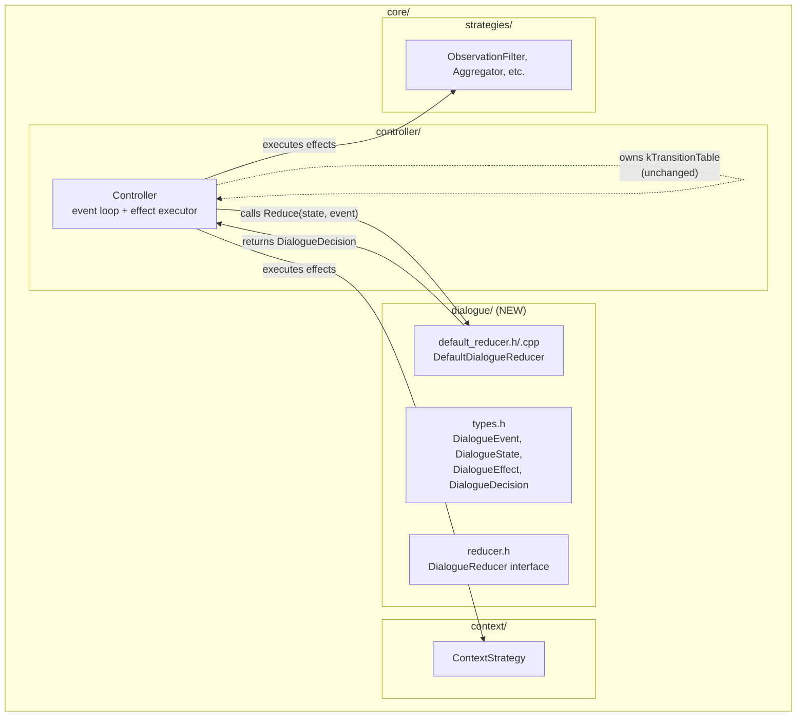
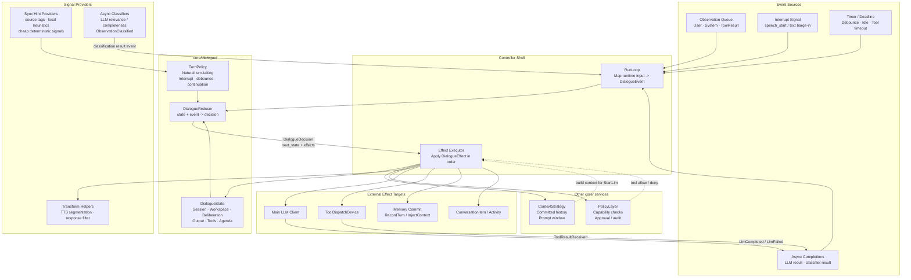
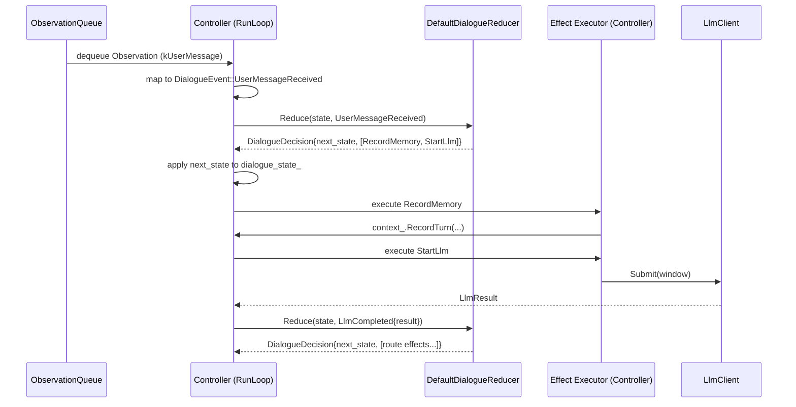
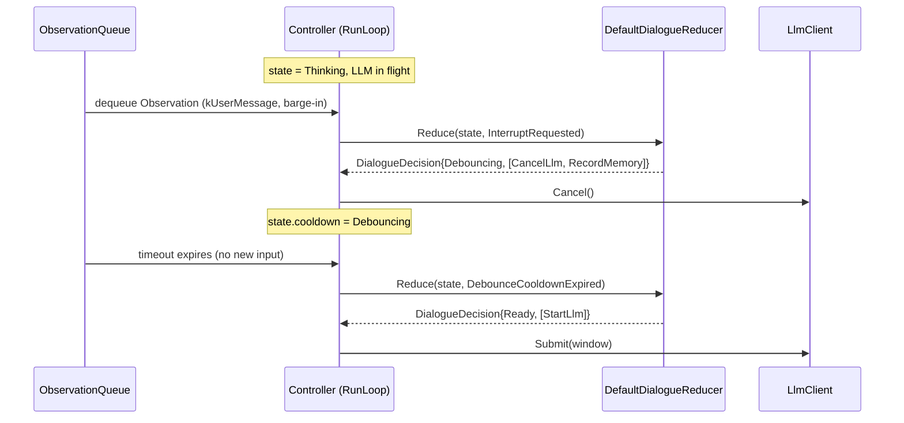

# Design Document: Dialogue Kernel Phase 1

## Overview

Phase 1 introduces the dialogue kernel shell into `core/dialogue/` — the foundational types, reducer interface, and a `DefaultDialogueReducer` that reproduces the current Controller's barge-in, debounce, and turn-taking behavior through explicit state + events + effects rather than scattered booleans.

The authoritative design reference is `.kiro/steering/dialogue-kernel.md`. This document focuses on concrete Phase 1 implementation decisions: which types to define, what the reducer covers, how Controller wires to it, and what stays unchanged. The goal is to prove the reducer pattern simplifies real code (specifically `post_interrupt_cooldown_` and barge-in logic) without adding an empty indirection layer.

Phase 1 does NOT include: async ObservationFilter migration, timer events, workspace vs committed history split, agenda, or mixed-initiative behavior. The existing `kTransitionTable`, strategies, and all external behavior remain unchanged.

## Architecture

Phase 1 adds `core/dialogue/` as a pure-logic module inside `core/`. Controller remains the event loop shell and effect executor. The dialogue module has zero dependencies on `io/`, `runtime/`, `services/`, or `app/`.



### Target Design Diagram

The Phase 1 implementation only introduces the shell, but it is designed to
fit into the following long-term structure.



- Phase 1 only implements the `Controller Shell -> Reducer -> Effects`
  skeleton plus the first reducer-owned turn-taking logic.
- `TurnPolicy` is shown here because Phase 1 is intentionally building toward
  that split, even though the initial reducer still packages the policy logic
  together.
- Sync hints, async classifiers, and transform helpers stay outside the
  reducer and feed it only through explicit data or events.

## Sequence Diagrams

### Normal Message Flow (via reducer)



### Barge-in + Debounce Flow (via reducer)



## Components and Interfaces

### Component 1: Dialogue Types (`core/dialogue/types.h`)

**Purpose**: Define the Phase 1 event, state, effect, and decision types used by the reducer.

```cpp
#pragma once

#include <chrono>
#include <optional>
#include <string>
#include <variant>
#include <vector>

#include "controller/types.h"  // Observation, ActionCandidate, MemoryEntry

namespace shizuru::core::dialogue {

// ---------------------------------------------------------------------------
// DialogueEvent — Phase 1 subset
// ---------------------------------------------------------------------------

struct UserMessageReceived {
  Observation observation;
};

struct SystemEventReceived {
  Observation observation;
};

struct InterruptRequested {
  std::chrono::steady_clock::time_point now;  // Explicit — reducer never reads system clock
};

struct DebounceCooldownExpired {
  std::chrono::steady_clock::time_point now;  // Explicit — reducer never reads system clock
};

struct LlmCompleted {
  ActionCandidate candidate;
  int prompt_tokens = 0;
  int completion_tokens = 0;
};

struct LlmFailed {
  std::string reason;
};

struct ToolResultReceived {
  Observation observation;
};

struct ToolCallTimeout {};

struct ContinuationRequested {
  std::string source;
};

struct ShutdownRequested {};

using DialogueEvent = std::variant<
    UserMessageReceived,
    SystemEventReceived,
    InterruptRequested,
    DebounceCooldownExpired,
    LlmCompleted,
    LlmFailed,
    ToolResultReceived,
    ToolCallTimeout,
    ContinuationRequested,
    ShutdownRequested>;

// ---------------------------------------------------------------------------
// DialogueState — Phase 1 subset
// ---------------------------------------------------------------------------

// Cooldown sub-state for post-interrupt debounce.
enum class CooldownPhase {
  kNone,       // Normal operation
  kDebouncing, // After barge-in, buffering input before thinking
};

struct DialogueState {
  // Whether a conversation is active (mirrors conversation_active_).
  bool conversation_active = false;

  // Post-interrupt cooldown phase.
  CooldownPhase cooldown = CooldownPhase::kNone;

  // Budget counters (moved from Controller booleans to explicit state).
  int turn_count = 0;
  int total_prompt_tokens = 0;
  int total_completion_tokens = 0;
  int action_count = 0;

  // Timestamps for budget and idle checks.
  std::chrono::steady_clock::time_point session_start;
  std::chrono::steady_clock::time_point last_activity;
};

// ---------------------------------------------------------------------------
// DialogueEffect — Phase 1 subset
// ---------------------------------------------------------------------------

struct RecordMemory {
  MemoryEntryType type;
  Observation observation;
};

struct StartLlm {
  Observation trigger;  // The observation that caused thinking
};

struct CancelLlm {};

struct EmitToolCallFrames {
  ActionCandidate action;
};

struct DeliverResponse {
  ActionCandidate action;
};

struct ResetBudgetWindow {};

struct EmitDiagnosticEffect {
  std::string message;
};

struct EmitActivityEffect {
  ActivityKind kind;
  std::string detail;
};

struct SignalBudgetExhausted {};

struct NoOp {};

using DialogueEffect = std::variant<
    RecordMemory,
    StartLlm,
    CancelLlm,
    EmitToolCallFrames,
    DeliverResponse,
    ResetBudgetWindow,
    EmitDiagnosticEffect,
    EmitActivityEffect,
    SignalBudgetExhausted,
    NoOp>;

// ---------------------------------------------------------------------------
// DialogueDecision
// ---------------------------------------------------------------------------

struct DialogueDecision {
  DialogueState next_state;
  std::vector<DialogueEffect> effects;
};

}  // namespace shizuru::core::dialogue
```

**Responsibilities**:
- Define the Phase 1 event taxonomy (subset of the full proposal)
- Define explicit dialogue state replacing `post_interrupt_cooldown_` and budget booleans
- Define effects as data — no I/O, no side effects in the types themselves
- Provide `DialogueDecision` as the reducer return type

### Component 2: DialogueReducer Interface (`core/dialogue/reducer.h`)

**Purpose**: Pure virtual interface for the reducer. Enables testing with alternative implementations.

```cpp
#pragma once

#include "dialogue/types.h"

namespace shizuru::core::dialogue {

class DialogueReducer {
 public:
  virtual ~DialogueReducer() = default;

  // Pure function: (state, event) → (next_state, effects).
  // Must not perform I/O, block, or access external state.
  virtual DialogueDecision Reduce(const DialogueState& state,
                                  const DialogueEvent& event) const = 0;
};

}  // namespace shizuru::core::dialogue
```

**Responsibilities**:
- Define the pure reducer contract
- `const` qualifier on `Reduce` enforces no mutation of reducer internals

### Component 3: DefaultDialogueReducer (`core/dialogue/default_reducer.h/.cpp`)

**Purpose**: Reproduce the current Controller's barge-in, debounce, and budget logic as a pure reducer. This is the Phase 1 concrete implementation.

```cpp
#pragma once

#include "controller/config.h"
#include "dialogue/reducer.h"

namespace shizuru::core::dialogue {

class DefaultDialogueReducer : public DialogueReducer {
 public:
  explicit DefaultDialogueReducer(const ControllerConfig& config);

  DialogueDecision Reduce(const DialogueState& state,
                          const DialogueEvent& event) const override;

 private:
  // Immutable config snapshot — no references to Controller.
  ControllerConfig config_;

  // Per-event handlers (all const, all pure).
  DialogueDecision HandleUserMessage(const DialogueState& state,
                                     const UserMessageReceived& event) const;
  DialogueDecision HandleSystemEvent(const DialogueState& state,
                                     const SystemEventReceived& event) const;
  DialogueDecision HandleInterrupt(const DialogueState& state) const;
  DialogueDecision HandleDebounceCooldownExpired(const DialogueState& state) const;
  DialogueDecision HandleLlmCompleted(const DialogueState& state,
                                      const LlmCompleted& event) const;
  DialogueDecision HandleLlmFailed(const DialogueState& state,
                                   const LlmFailed& event) const;
  DialogueDecision HandleToolResult(const DialogueState& state,
                                    const ToolResultReceived& event) const;
  DialogueDecision HandleToolCallTimeout(const DialogueState& state) const;
  DialogueDecision HandleContinuation(const DialogueState& state,
                                      const ContinuationRequested& event) const;

  // Budget check — pure, returns whether any limit is exceeded.
  bool IsBudgetExhausted(const DialogueState& state) const;
};

}  // namespace shizuru::core::dialogue
```

**Responsibilities**:
- Implement barge-in → debounce transition: when `InterruptRequested` arrives, set `cooldown = kDebouncing` and emit `CancelLlm` + `RecordMemory`
- Implement debounce expiry: when `DebounceCooldownExpired` arrives, clear cooldown and emit `StartLlm`
- Implement post-interrupt buffering: when `UserMessageReceived` arrives during `kDebouncing`, emit `RecordMemory` but stay in debounce (don't start thinking)
- Implement budget checks: return `SignalBudgetExhausted` when limits exceeded
- All methods are `const` — no mutation, no I/O

## Data Models

### DialogueState

```cpp
struct DialogueState {
  bool conversation_active = false;
  CooldownPhase cooldown = CooldownPhase::kNone;
  int turn_count = 0;
  int total_prompt_tokens = 0;
  int total_completion_tokens = 0;
  int action_count = 0;
  std::chrono::steady_clock::time_point session_start;
  std::chrono::steady_clock::time_point last_activity;
};
```

**Validation Rules**:
- `turn_count >= 0`
- `total_prompt_tokens >= 0`, `total_completion_tokens >= 0`
- `action_count >= 0`
- `cooldown` is always a valid `CooldownPhase` enum value

**Mapping from current Controller fields**:

| Controller field | DialogueState field | Notes |
|---|---|---|
| `post_interrupt_cooldown_` | `cooldown` | `bool` → `CooldownPhase` enum |
| `conversation_active_` | `conversation_active` | Direct move |
| `turn_count_` | `turn_count` | Direct move |
| `total_prompt_tokens_` | `total_prompt_tokens` | Direct move |
| `total_completion_tokens_` | `total_completion_tokens` | Direct move |
| `action_count_` | `action_count` | Direct move |
| `session_start_` | `session_start` | Direct move |
| `last_activity_` | `last_activity` | Direct move |

### DialogueEvent mapping from current Controller branches

| Controller code path | DialogueEvent |
|---|---|
| `obs.type == kUserMessage` in Listening/Idle | `UserMessageReceived` |
| `obs.type == kSystemEvent` in Listening/Idle | `SystemEventReceived` |
| `obs.type == kInterruption` | `InterruptRequested` |
| `obs.type == kUserMessage` during Thinking/Routing/Acting (barge-in) | `InterruptRequested` + `UserMessageReceived` |
| `post_interrupt_cooldown_` timeout expires | `DebounceCooldownExpired` |
| LLM returns successfully | `LlmCompleted` |
| LLM fails after retries | `LlmFailed` |
| `obs.type == kToolResult` in Acting | `ToolResultReceived` |
| Tool call timeout | `ToolCallTimeout` |
| `obs.type == kContinuation` | `ContinuationRequested` |

## Algorithmic Pseudocode

### DefaultDialogueReducer::Reduce (dispatch)

```cpp
DialogueDecision DefaultDialogueReducer::Reduce(
    const DialogueState& state,
    const DialogueEvent& event) const {
  return std::visit(overloaded{
    [&](const UserMessageReceived& e) { return HandleUserMessage(state, e); },
    [&](const SystemEventReceived& e) { return HandleSystemEvent(state, e); },
    [&](const InterruptRequested&)    { return HandleInterrupt(state); },
    [&](const DebounceCooldownExpired&) {
      return HandleDebounceCooldownExpired(state);
    },
    [&](const LlmCompleted& e) { return HandleLlmCompleted(state, e); },
    [&](const LlmFailed& e)    { return HandleLlmFailed(state, e); },
    [&](const ToolResultReceived& e) { return HandleToolResult(state, e); },
    [&](const ToolCallTimeout&) { return HandleToolCallTimeout(state); },
    [&](const ContinuationRequested& e) {
      return HandleContinuation(state, e);
    },
    [&](const ShutdownRequested&) {
      return DialogueDecision{state, {}};
    },
  }, event);
}
```

**Preconditions:**
- `state` is a valid `DialogueState`
- `event` holds exactly one active variant

**Postconditions:**
- Returns a `DialogueDecision` with a valid `next_state` and zero or more effects
- No side effects performed

### HandleUserMessage (normal flow + debounce buffering)

```cpp
DialogueDecision DefaultDialogueReducer::HandleUserMessage(
    const DialogueState& state,
    const UserMessageReceived& event) const {
  auto next = state;
  std::vector<DialogueEffect> effects;
  auto now = event.observation.timestamp;

  // If in debounce cooldown, buffer the message but don't start thinking.
  if (state.cooldown == CooldownPhase::kDebouncing) {
    effects.push_back(RecordMemory{
        MemoryEntryType::kUserMessage, event.observation});
    return {next, effects};
  }

  // Check if budget window needs reset.
  bool reset_window = !state.conversation_active ||
      (now - state.last_activity >= config_.conversation_idle_timeout);
  if (reset_window) {
    next.turn_count = 0;
    next.total_prompt_tokens = 0;
    next.total_completion_tokens = 0;
    next.action_count = 0;
    next.session_start = now;
    effects.push_back(ResetBudgetWindow{});
  }

  next.conversation_active = true;
  next.last_activity = now;
  next.session_start = now;

  // Record and start thinking.
  effects.push_back(RecordMemory{
      MemoryEntryType::kUserMessage, event.observation});
  effects.push_back(StartLlm{event.observation});

  return {next, effects};
}
```

**Preconditions:**
- `event.observation.type == kUserMessage`

**Postconditions:**
- If `cooldown == kDebouncing`: state unchanged except RecordMemory effect emitted
- If `cooldown == kNone`: conversation marked active, budget possibly reset, StartLlm emitted
- No I/O performed

### HandleInterrupt (barge-in → debounce)

```cpp
DialogueDecision DefaultDialogueReducer::HandleInterrupt(
    const DialogueState& state) const {
  auto next = state;
  std::vector<DialogueEffect> effects;

  next.cooldown = CooldownPhase::kDebouncing;
  next.conversation_active = true;
  next.last_activity = state.cooldown == CooldownPhase::kNone
      ? /* now from event */ : state.last_activity;

  // NOTE: 'now' comes from InterruptRequested.now, not steady_clock::now()
  effects.push_back(CancelLlm{});
  // No separate SignalInterrupted — CancelLlm is the single interrupt effect
  // that handles cancellation + state transition + activity notification

  return {next, effects};
}
```

**Preconditions:**
- Controller is in Thinking, Routing, or Acting state (enforced by Controller, not reducer)

**Postconditions:**
- `next.cooldown == CooldownPhase::kDebouncing`
- `CancelLlm` effect emitted
- No I/O performed

### HandleDebounceCooldownExpired

```cpp
DialogueDecision DefaultDialogueReducer::HandleDebounceCooldownExpired(
    const DialogueState& state) const {
  auto next = state;
  std::vector<DialogueEffect> effects;

  next.cooldown = CooldownPhase::kNone;

  if (IsBudgetExhausted(next)) {
    effects.push_back(SignalBudgetExhausted{});
  } else {
    Observation cont;
    cont.type = ObservationType::kContinuation;
    cont.source = "controller";
    cont.timestamp = state.last_activity;  // Use state timestamp, not system clock
    effects.push_back(StartLlm{cont});
  }

  return {next, effects};
}
```

**Preconditions:**
- `state.cooldown == CooldownPhase::kDebouncing`

**Postconditions:**
- `next.cooldown == CooldownPhase::kNone`
- Either `StartLlm` or `SignalBudgetExhausted` emitted

### IsBudgetExhausted (pure check)

```cpp
bool DefaultDialogueReducer::IsBudgetExhausted(
    const DialogueState& state) const {
  if (state.turn_count >= config_.max_turns) return true;
  if (state.total_prompt_tokens + state.total_completion_tokens
      >= config_.token_budget) return true;
  if (state.action_count >= config_.action_count_limit) return true;
  // Use explicit 'now' from event, not steady_clock::now()
  auto elapsed = now - state.session_start;
  if (elapsed >= config_.turn_timeout) return true;
  return false;
}
```

**Preconditions:**
- `state` has valid budget counters
- `config_` has valid limits

**Postconditions:**
- Returns `true` if any budget limit is exceeded
- No side effects

## Key Functions with Formal Specifications

### DialogueReducer::Reduce

```cpp
virtual DialogueDecision Reduce(const DialogueState& state,
                                const DialogueEvent& event) const = 0;
```

**Preconditions:**
- `state` is a structurally valid `DialogueState`
- `event` holds exactly one active variant alternative

**Postconditions:**
- Returns `DialogueDecision` where `next_state` is a valid `DialogueState`
- `effects` vector contains zero or more valid `DialogueEffect` values
- No side effects: no I/O, no mutation of shared state, no blocking
- Deterministic: same `(state, event)` always produces same `(next_state, effects)`

**Loop Invariants:** N/A (no loops in the interface contract)

### Controller integration point

```cpp
// In Controller::RunLoop, replaces inline barge-in/debounce logic:
void Controller::ApplyDialogueDecision(const dialogue::DialogueDecision& decision);
```

**Preconditions:**
- Called on the loop thread only
- `decision` was produced by `reducer_->Reduce(...)`

**Postconditions:**
- `dialogue_state_` updated to `decision.next_state`
- Each effect in `decision.effects` executed in order
- Effects may trigger state transitions via existing `TryTransition`
- Effects may enqueue new observations (e.g., continuation after debounce)

## Example Usage

```cpp
// Construction: Controller creates the reducer and initial state
Controller::Controller(/* ... existing params ... */)
    : /* ... existing initializers ... */,
      reducer_(std::make_unique<dialogue::DefaultDialogueReducer>(config_)),
      dialogue_state_{} {}

// In RunLoop — barge-in detection (replaces inline boolean logic):
if (obs.type == ObservationType::kUserMessage &&
    (current == State::kThinking || current == State::kRouting ||
     current == State::kActing)) {
  // Ask reducer what to do instead of inline HandleInterrupt + boolean set.
  auto decision = reducer_->Reduce(
      dialogue_state_, dialogue::InterruptRequested{});
  ApplyDialogueDecision(decision);

  // Record the interrupting message via reducer.
  auto record_decision = reducer_->Reduce(
      dialogue_state_,
      dialogue::UserMessageReceived{obs});
  ApplyDialogueDecision(record_decision);
  continue;
}

// Post-interrupt cooldown expiry (replaces inline boolean check):
if (post_interrupt_cooldown_timeout_expired) {
  auto decision = reducer_->Reduce(
      dialogue_state_, dialogue::DebounceCooldownExpired{});
  ApplyDialogueDecision(decision);
  continue;
}

// Effect execution example:
void Controller::ApplyDialogueDecision(
    const dialogue::DialogueDecision& decision) {
  dialogue_state_ = decision.next_state;
  for (const auto& effect : decision.effects) {
    std::visit(overloaded{
      [&](const dialogue::RecordMemory& e) {
        MemoryEntry entry = MemoryEntryFromItem(
            e.type, EnsureConversationItem(e.observation),
            e.observation.timestamp);
        context_.RecordTurn(session_id_, entry);
      },
      [&](const dialogue::CancelLlm&) {
        // Inline execution — NOT delegating to HandleInterrupt()
        llm_->Cancel();
        if (cancel_) cancel_();
        if (tts_segment_) tts_segment_->Reset();
        observation_aggregator_->Reset();
        // Record interrupt entry
        MemoryEntry interrupt_entry;
        interrupt_entry.type = MemoryEntryType::kAssistantMessage;
        interrupt_entry.role = "system";
        interrupt_entry.content = "Turn interrupted";
        interrupt_entry.timestamp = std::chrono::steady_clock::now();
        context_.RecordTurn(session_id_, interrupt_entry);
        ResetAssistantTurnUiState();
        TryTransition(Event::kInterrupt);
      },
      [&](const dialogue::StartLlmContinuation& e) {
        // Build continuation and enter thinking
        TryTransition(Event::kUserObservation);
        Observation cont;
        cont.type = ObservationType::kContinuation;
        cont.source = "controller";
        cont.timestamp = e.now;
        HandleThinking(cont);  // Acceptable: continuation entry point
      },
      [&](const dialogue::SignalBudgetExhausted&) {
        ResetAssistantTurnUiState();
        TryTransition(Event::kStopConditionMet);
        EmitActivity(ActivityKind::kBudgetExhausted);
      },
      [&](const dialogue::EmitActivityEffect& e) {
        EmitActivity(e.kind, e.detail);
      },
      [&](const dialogue::NoOp&) {},
    }, effect);
  }
}
```

## Correctness Properties

*A property is a characteristic or behavior that should hold true across all valid executions of a system — essentially, a formal statement about what the system should do. Properties serve as the bridge between human-readable specifications and machine-verifiable correctness guarantees.*

These properties are expressed as universal quantification statements suitable for property-based testing with RapidCheck.

### Property 1: Reducer purity — no side effects

*For any* valid `DialogueState` and `DialogueEvent`, calling `Reduce(state, event)` returns a `DialogueDecision` without modifying `state` or any external state. Calling `Reduce` twice with the same inputs produces identical outputs.

**Validates: Requirements 3.4, 3.5**

### Property 2: Barge-in enters debounce

*For any* `DialogueState` where `cooldown == kNone`, calling `Reduce(state, InterruptRequested{now})` produces a decision where `next_state.cooldown == kDebouncing` and effects contain `CancelLlm` (single interrupt effect, no separate SignalInterrupted).

**Validates: Requirements 4.1**

### Property 3: Debounce buffers without thinking

*For any* `DialogueState` where `cooldown == kDebouncing` and any `UserMessageReceived` event, calling `Reduce(state, event)` produces a decision where `next_state.cooldown == kDebouncing`, effects contain `RecordMemory`, and effects do NOT contain `StartLlm`.

**Validates: Requirements 4.3, 4.4**

### Property 4: Debounce expiry starts thinking

*For any* `DialogueState` where `cooldown == kDebouncing` and `IsBudgetExhausted(state)` is false, calling `Reduce(state, DebounceCooldownExpired{})` produces a decision where `next_state.cooldown == kNone` and effects contain `StartLlm`.

**Validates: Requirements 4.5**

### Property 5: Budget exhaustion prevents thinking

*For any* `DialogueState` where `IsBudgetExhausted(state)` is true, calling `Reduce(state, DebounceCooldownExpired{})` produces a decision where effects contain `SignalBudgetExhausted` and effects do NOT contain `StartLlm`.

**Validates: Requirements 4.6, 6.1, 6.2, 6.3**

### Property 6: LlmCompleted updates budget counters

*For any* `DialogueState` and `LlmCompleted` event with given `prompt_tokens` and `completion_tokens`, calling `Reduce(state, event)` produces a decision where `next_state.turn_count == state.turn_count + 1`, `next_state.total_prompt_tokens == state.total_prompt_tokens + prompt_tokens`, and `next_state.total_completion_tokens == state.total_completion_tokens + completion_tokens`.

**Validates: Requirements 7.1, 7.2**

### Property 7: Behavioral equivalence with current Controller

*For any* sequence of observations that the current Controller processes, the sequence of (state transitions, memory recordings, LLM invocations) produced by Controller+DefaultDialogueReducer is identical to the sequence produced by the current Controller without the reducer, for: normal message flow, barge-in + debounce, tool call cycles, and budget exhaustion.

**Validates: Requirements 11.1, 11.3**

## Error Handling

### Error Scenario 1: LLM Failure After Retries

**Condition**: `LlmFailed` event arrives after all retries exhausted
**Response**: Reducer returns state with no active thinking, emits `EmitDiagnosticEffect` with failure reason
**Recovery**: Controller transitions to `State::kError` via existing `kTransitionTable`. External `kRecover` event returns to `kIdle`.

### Error Scenario 2: Tool Call Timeout

**Condition**: `ToolCallTimeout` event when pending tool results haven't arrived
**Response**: Reducer emits effects to record timeout as failed tool results, then `ContinuationRequested` to re-enter thinking
**Recovery**: Controller fills in timeout results for missing tool calls, transitions via `kActionFailed`

### Error Scenario 3: Invalid Event for Current State

**Condition**: Event arrives that doesn't match current Controller state (e.g., `ToolResultReceived` when not in Acting)
**Response**: Reducer returns current state unchanged with no effects (no-op)
**Recovery**: Controller's existing `TryTransition` rejects invalid transitions; diagnostic emitted

## Testing Strategy

### Unit Testing Approach

- Test each `Handle*` method of `DefaultDialogueReducer` in isolation
- Construct specific `DialogueState` + `DialogueEvent` pairs, assert on returned `DialogueDecision`
- Verify effect lists contain expected effects and do NOT contain unexpected ones
- Test `IsBudgetExhausted` with boundary values for each limit
- Test file: `tests/agent/dialogue_reducer_test.cpp`

### Property-Based Testing Approach

Property-based tests using RapidCheck + Google Test, following the existing patterns in `tests/agent/controller_prop_test.cpp`.

**Property Test Library**: RapidCheck (`rapidcheck` + `rapidcheck_gtest`)

**Generators needed**:
- `genDialogueState()` — random valid `DialogueState` with constrained ranges
- `genDialogueEvent()` — random valid `DialogueEvent` variant
- `genControllerConfig()` — reuse existing generator from `controller_prop_test.cpp`

**Properties to test** (corresponding to Correctness Properties above):
1. Reducer purity (determinism, no mutation)
2. Barge-in → debounce transition
3. Debounce buffering (no StartLlm)
4. Debounce expiry → thinking
5. Budget exhaustion prevents thinking
6. LlmCompleted counter updates
7. Behavioral equivalence with current Controller (integration-level property test)

**Behavioral equivalence test approach**:
- Generate random sequences of observations (user messages, interrupts, tool results)
- Run them through both the old Controller path and the new reducer path
- Compare: state transitions fired, memory entries recorded, LLM calls made
- This is the most important property — it proves the refactor is safe

Test file: `tests/agent/dialogue_reducer_prop_test.cpp`

### Integration Testing Approach

- Wire `DefaultDialogueReducer` into Controller and run existing `controller_test.cpp` and `controller_prop_test.cpp` — all must pass unchanged
- This validates that the reducer integration doesn't alter external behavior

## Performance Considerations

- The reducer is called on the Controller's loop thread. All `Reduce` calls must be fast (microseconds, not milliseconds).
- `std::variant` dispatch via `std::visit` compiles to a jump table — negligible overhead vs the current `if/else` chains.
- `DialogueDecision` returns by value. The `effects` vector is typically small (1-3 elements). Move semantics ensure no unnecessary copies.
- No heap allocation in the hot path beyond the `effects` vector itself.

## Security Considerations

No new security surface. The dialogue module is pure computation with no I/O, no network access, and no user-facing API. All external interactions remain in Controller's effect executor, which is unchanged.

## Dependencies

- `core/controller/types.h` — reuses `Observation`, `ActionCandidate`, `MemoryEntryType`, `ActivityKind`
- `core/controller/config.h` — `ControllerConfig` (read-only snapshot)
- C++17 `<variant>`, `<vector>`, `<chrono>`, `<string>`, `<optional>`
- No new external dependencies
- Build: add `dialogue/default_reducer.cpp` to `core/CMakeLists.txt`'s `shizuru_core` target
- Tests: add `dialogue_reducer_test.cpp` and `dialogue_reducer_prop_test.cpp` to `tests/agent/CMakeLists.txt`
