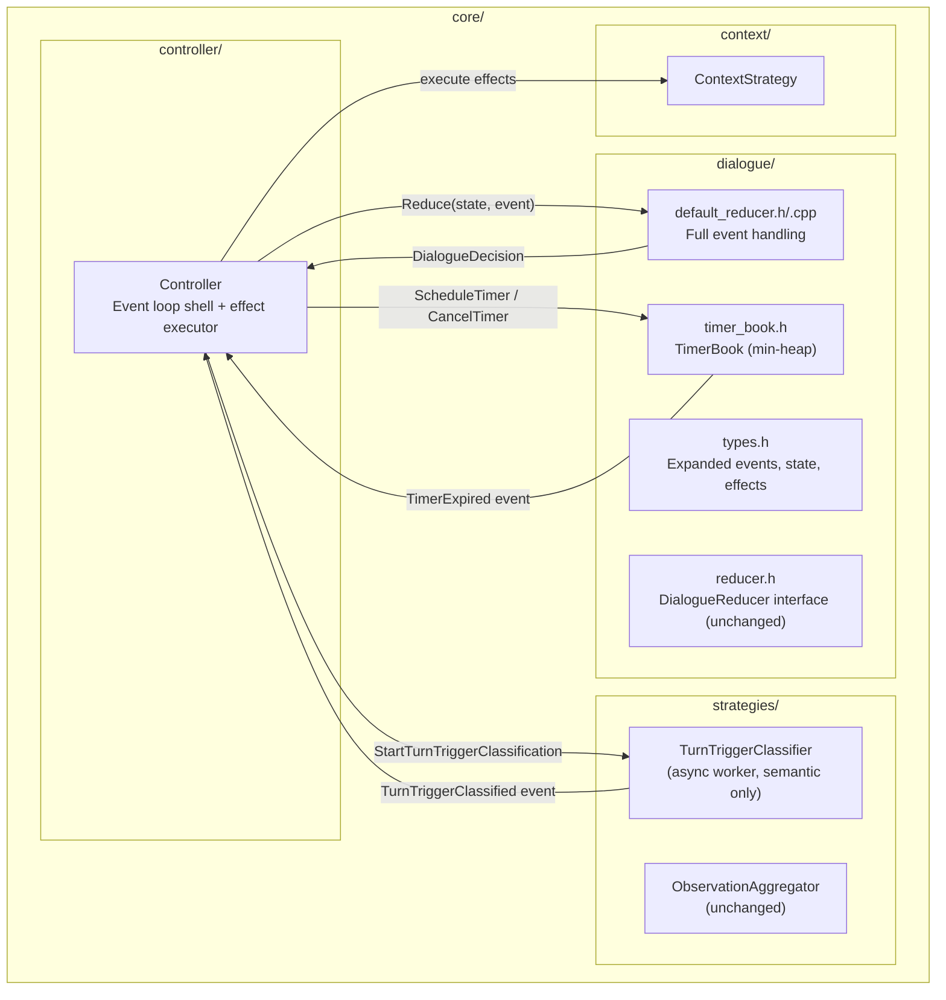
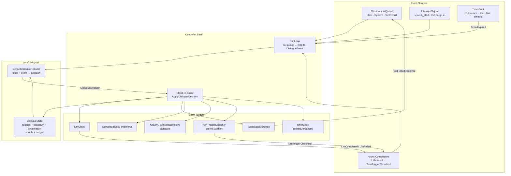
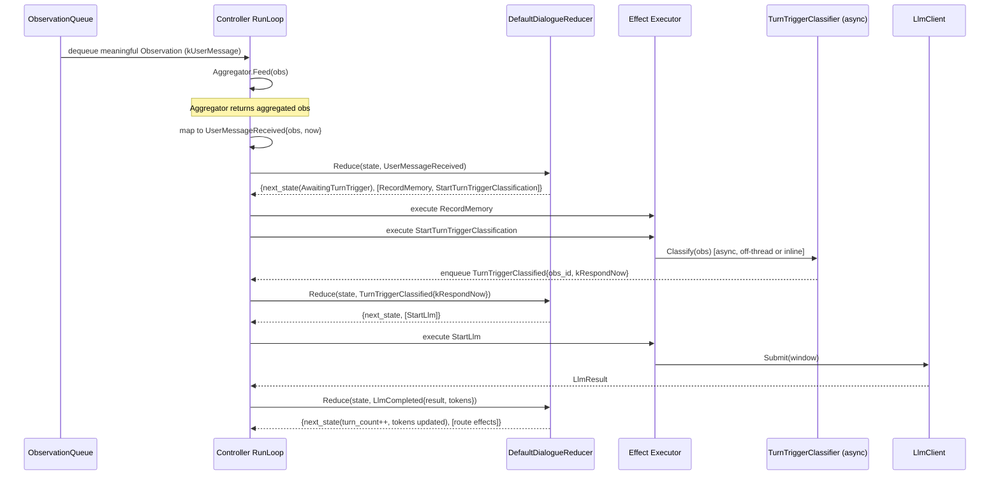
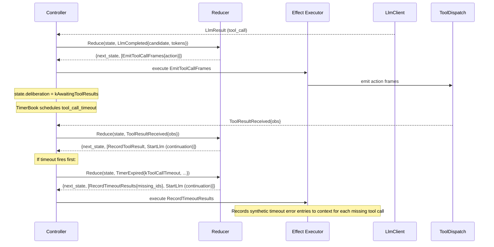
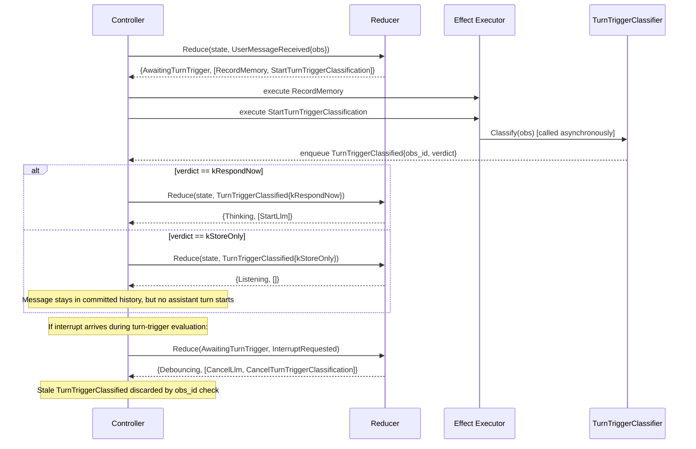
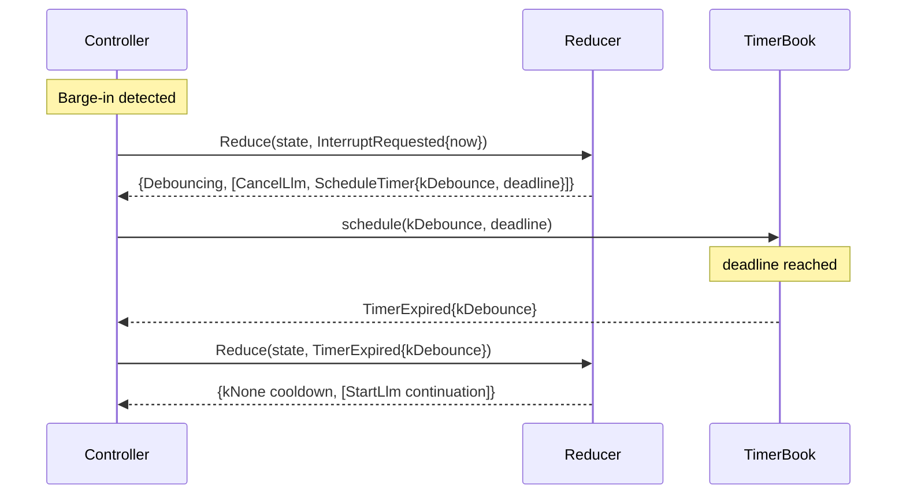

# Design Document: Dialogue Kernel Phase 2

## Overview

Phase 2 migrates the remaining Controller inline turn-taking logic into the dialogue reducer: normal user messages, LLM completion/failure, tool result/timeout, system events, continuation requests, and turn-trigger policy evaluation. It also introduces a `TimerBook` for explicit timer management.

**Scope boundary:** ObservationAggregator remains a synchronous pre-reducer step in Controller (Feed + CheckTimeout). Aggregator event-ization is deferred to Phase 3 alongside the provisional turn workspace. Data-plane noise filtering is also explicitly out of scope for Phase 2: VAD noise rejection, ASR garbage suppression, transcript cleanup, and similar validity checks belong upstream of `core/` in the data plane. Inputs reaching the reducer are assumed to already be meaningful observations. Phase 2 therefore does NOT complete all turn-taking semantics migration — it completes all *post-aggregation, post-sanitization* semantics migration.

The six concrete deliverables are: (1) route normal user messages through the reducer instead of inline Controller logic, (2) route LLM completion/failure through the reducer so token and turn accounting lives in explicit state, (3) route tool result and tool timeout through the reducer, (4) introduce a `TimerBook` and explicit `TimerExpired` events replacing implicit `wait_for` polling, (5) add new internal event types (`SystemEventReceived` handling, `ContinuationRequested` handling), and (6) replace the reducer-owned "filter" concept with an async turn-trigger classification effect (`StartTurnTriggerClassification` → `TurnTriggerClassified`). The existing `ObservationFilter` interface may be adapted underneath as an implementation detail, but its semantic role inside `core/` is no longer "drop invalid input".

After Phase 2, Controller's `RunLoop` becomes a thin event-mapping and effect-execution shell for all post-aggregation paths. All semantic decisions — what to do when a message arrives, how to handle an LLM result, when to time out a tool call — live in the reducer and are testable as pure state transitions.

### Behavioral continuity: memory vs response

Phase 2 keeps the current memory semantics for meaningful user messages: once an observation reaches `core/`, it is treated as worth preserving in committed history even if the assistant ultimately decides not to reply immediately. The semantic classifier therefore does **not** decide whether the message exists; it decides whether the message should trigger a turn now.

The reducer records meaningful user messages on receipt, then asks the turn-trigger classifier whether to:

- `kRespondNow` — start an assistant turn immediately
- `kStoreOnly` — preserve the message in history but do not start an assistant turn

Noise dropping remains upstream in the data plane and is not modeled as a reducer verdict.

## Architecture

Phase 2 does not add new modules. It deepens `core/dialogue/` by expanding the event taxonomy, state shape, and effect vocabulary, then rewires Controller's remaining inline branches to go through the reducer.



### Full Event Flow (Phase 2 Target)



## Sequence Diagrams

### Normal User Message (Phase 2 — fully through reducer)



### LLM Completion → Routing → Tool Call → Result (Phase 2)



### TurnTriggerClassifier Async Migration




### Timer-Based Debounce (replaces implicit wait_for polling)



## Components and Interfaces

### Component 1: Expanded DialogueEvent Taxonomy (`core/dialogue/types.h`)

**Purpose**: Extend the Phase 1 event variant to cover all Controller branches.

Phase 1 declared stub structs for `LlmCompleted`, `LlmFailed`, `ToolResultReceived`, `ToolCallTimeout`, `ContinuationRequested`, `SystemEventReceived`. Phase 2 populates them with real payloads and adds new event types.

**New/modified event structs:**

```cpp
// --- Modified (add payloads to Phase 1 stubs) ---

struct LlmCompleted {
  ActionCandidate candidate;
  int prompt_tokens = 0;
  int completion_tokens = 0;
  std::chrono::steady_clock::time_point now;
};

struct LlmFailed {
  std::string reason;
  std::chrono::steady_clock::time_point now;
};

struct ToolResultReceived {
  Observation observation;
  std::chrono::steady_clock::time_point now;
};

struct ToolCallTimeout {
  std::vector<std::string> missing_tool_call_ids;
  std::chrono::steady_clock::time_point now;
};

struct ContinuationRequested {
  std::string source;
  std::chrono::steady_clock::time_point now;
};

struct SystemEventReceived {
  Observation observation;
  std::chrono::steady_clock::time_point now;
};

// --- New events ---

struct TimerExpired {
  TimerKind kind;  // kDebounce, kToolCallTimeout, kConversationIdle
  std::string timer_id;
  std::chrono::steady_clock::time_point now;
};

struct TurnTriggerClassified {
  uint64_t obs_id;
  TurnTriggerVerdict verdict;  // kRespondNow, kStoreOnly
  std::chrono::steady_clock::time_point now;
};
```

**New enums:**

```cpp
enum class TimerKind {
  kDebounce,
  kToolCallTimeout,
  kConversationIdle,
};

enum class TurnTriggerVerdict {
  kRespondNow,
  kStoreOnly,
};

enum class DeliberationPhase {
  kIdle,                        // No LLM request in flight
  kAwaitingTurnTrigger,         // Waiting for TurnTriggerClassified
  kThinking,                    // LLM request in flight
  kAwaitingToolResults,         // Tool calls dispatched, waiting for results
};
```

**Updated variant:**

```cpp
using DialogueEvent = std::variant<
    InterruptRequested,
    DebounceCooldownExpired,     // Kept for backward compat, replaced by TimerExpired{kDebounce}
    UserMessageReceived,
    ShutdownRequested,
    LlmCompleted,
    LlmFailed,
    ToolResultReceived,
    ToolCallTimeout,
    ContinuationRequested,
    SystemEventReceived,
    TimerExpired,
    TurnTriggerClassified>;
```

**Responsibilities:**
- Every Controller branch maps to exactly one event type
- All events carry explicit `now` timestamps — reducer never reads system clock
- `TurnTriggerClassified` carries a correlation `obs_id` for stale-result rejection

### Component 2: Expanded DialogueState (`core/dialogue/types.h`)

**Purpose**: Add deliberation phase and tool tracking to the state.

```cpp
struct DialogueState {
  // --- Phase 1 fields (unchanged) ---
  bool conversation_active = false;
  CooldownPhase cooldown = CooldownPhase::kNone;
  int turn_count = 0;
  int total_prompt_tokens = 0;
  int total_completion_tokens = 0;
  int action_count = 0;
  std::chrono::steady_clock::time_point session_start;
  std::chrono::steady_clock::time_point last_activity;

  // --- Phase 2 additions ---
  DeliberationPhase deliberation = DeliberationPhase::kIdle;

  // Monotonic counter for generating unique turn-trigger correlation ids.
  // Only incremented, never reset — ensures ids are never reused even after
  // interrupt resets pending_turn_trigger_id to 0.
  uint64_t next_turn_trigger_id = 0;

  // The id of the currently in-flight turn-trigger evaluation.
  // Set to a value from next_turn_trigger_id when classification starts.
  // Reset to 0 on interrupt or when classification completes.
  // Stale TurnTriggerClassified events are rejected by obs_id != pending_turn_trigger_id.
  uint64_t pending_turn_trigger_id = 0;

  // Pending tool calls (ids of tool calls awaiting results).
  std::vector<std::string> pending_tool_call_ids;

  // Collected tool results (id → result JSON).
  std::unordered_map<std::string, std::string> pending_tool_results;
};
```

**Validation Rules:**
- `deliberation` is always a valid `DeliberationPhase` enum value
- `pending_turn_trigger_id > 0` only when `deliberation == kAwaitingTurnTrigger`
- `next_turn_trigger_id >= pending_turn_trigger_id` always (monotonic)
- `pending_tool_call_ids` is non-empty only when `deliberation == kAwaitingToolResults`
- All Phase 1 validation rules still apply

### Component 3: Expanded DialogueEffect (`core/dialogue/types.h`)

**Purpose**: Add effects for the newly reducer-owned paths.

```cpp
// --- New effects ---

struct StartLlm {
  Observation trigger;
};

struct EmitToolCallFrames {
  ActionCandidate action;
};

struct RecordToolResult {
  Observation observation;
};

struct RecordToolCallDecision {
  ActionCandidate action;
};

struct DeliverResponse {
  ActionCandidate action;
};

struct ResetBudgetWindow {};

struct EmitDiagnosticEffect {
  std::string message;
};

struct ScheduleTimer {
  TimerKind kind;
  std::string timer_id;
  std::chrono::steady_clock::time_point deadline;
};

struct CancelTimer {
  std::string timer_id;
};

struct StartTurnTriggerClassification {
  uint64_t obs_id;
  Observation observation;
};

struct CancelTurnTriggerClassification {
  uint64_t obs_id;
};

struct TransitionState {
  Event event;  // Controller FSM event to fire
};

struct RecordInterruptMemory {};

// NOTE: In Phase 2, the CancelLlm effect handler (from Phase 1) must be
// updated to NO LONGER record interrupt memory inline.  That responsibility
// moves to the explicit RecordInterruptMemory effect.  HandleInterrupt emits
// both CancelLlm and RecordInterruptMemory; the effect executor must not
// double-record.

struct RecordTimeoutResults {
  std::vector<std::string> missing_tool_call_ids;
};

// Updated variant:
using DialogueEffect = std::variant<
    RecordMemory,
    CancelLlm,
    StartLlmContinuation,
    EmitActivityEffect,
    SignalBudgetExhausted,
    NoOp,
    StartLlm,
    EmitToolCallFrames,
    RecordToolResult,
    RecordToolCallDecision,
    DeliverResponse,
    ResetBudgetWindow,
    EmitDiagnosticEffect,
    ScheduleTimer,
    CancelTimer,
    StartTurnTriggerClassification,
    CancelTurnTriggerClassification,
    TransitionState,
    RecordInterruptMemory,
    RecordTimeoutResults>;
```

### Component 4: TimerBook (`core/dialogue/timer_book.h`)

**Purpose**: A min-heap of named deadlines. Controller polls `TimerBook::NextDeadline()` to compute `wait_for` duration, and calls `TimerBook::PopExpired(now)` to harvest `TimerExpired` events.

```cpp
#pragma once

#include <chrono>
#include <cstdint>
#include <optional>
#include <queue>
#include <string>
#include <unordered_map>
#include <vector>

namespace shizuru::core::dialogue {

enum class TimerKind {
  kDebounce,
  kToolCallTimeout,
  kConversationIdle,
};

struct TimerEntry {
  TimerKind kind;
  std::string timer_id;
  uint64_t generation;  // Monotonic generation — stale entries are skipped
  std::chrono::steady_clock::time_point deadline;

  bool operator>(const TimerEntry& other) const {
    return deadline > other.deadline;
  }
};

// Generation-safe timer book.
//
// Each timer_id has a current generation counter. Schedule() increments the
// generation and pushes a new entry. Cancel() increments the generation
// without pushing. PopExpired() skips entries whose generation does not
// match the current generation for their timer_id.
//
// This means Schedule("x") → Cancel("x") → Schedule("x") works correctly:
// the second Schedule gets a new generation, and the first entry (now stale)
// is silently skipped on pop.
class TimerBook {
 public:
  // Schedule a timer. If a timer with the same timer_id already exists,
  // the old entry becomes stale (its generation no longer matches).
  void Schedule(TimerKind kind, std::string timer_id,
                std::chrono::steady_clock::time_point deadline);

  // Cancel a timer by timer_id. Increments the generation so any
  // in-heap entry for this id becomes stale.
  void Cancel(const std::string& timer_id);

  // Returns the earliest non-stale deadline, or nullopt if empty.
  std::optional<std::chrono::steady_clock::time_point> NextDeadline() const;

  // Pops all non-stale timers whose deadline <= now. Returns in deadline order.
  std::vector<TimerEntry> PopExpired(
      std::chrono::steady_clock::time_point now);

  bool Empty() const;

 private:
  std::priority_queue<TimerEntry, std::vector<TimerEntry>,
                      std::greater<TimerEntry>> heap_;
  // timer_id → current generation. Entries in the heap with a different
  // generation are stale and will be skipped.
  std::unordered_map<std::string, uint64_t> generations_;
};

}  // namespace shizuru::core::dialogue
```

**Responsibilities:**
- O(log n) schedule and pop
- Generation-safe: Schedule("x") → Cancel("x") → Schedule("x") works correctly because each operation increments the generation counter, and stale heap entries are silently skipped
- Controller uses `NextDeadline()` to replace hardcoded `wait_for` durations
- Pure data structure, no threads, no I/O

### Component 5: DefaultDialogueReducer — Expanded Handlers

**Purpose**: Implement all per-event handlers that Phase 1 left as no-ops.

```cpp
class DefaultDialogueReducer : public DialogueReducer {
 public:
  explicit DefaultDialogueReducer(const ControllerConfig& config);

  DialogueDecision Reduce(const DialogueState& state,
                          const DialogueEvent& event) const override;

 private:
  ControllerConfig config_;

  // --- Phase 1 handlers (updated) ---
  DialogueDecision HandleInterrupt(
      const DialogueState& state,
      std::chrono::steady_clock::time_point now) const;

  DialogueDecision HandleDebounceCooldownExpired(
      const DialogueState& state,
      std::chrono::steady_clock::time_point now) const;

  DialogueDecision HandleUserMessage(
      const DialogueState& state,
      const UserMessageReceived& event) const;

  // --- Phase 2 handlers (new) ---
  DialogueDecision HandleSystemEvent(
      const DialogueState& state,
      const SystemEventReceived& event) const;

  DialogueDecision HandleLlmCompleted(
      const DialogueState& state,
      const LlmCompleted& event) const;

  DialogueDecision HandleLlmFailed(
      const DialogueState& state,
      const LlmFailed& event) const;

  DialogueDecision HandleToolResult(
      const DialogueState& state,
      const ToolResultReceived& event) const;

  DialogueDecision HandleToolCallTimeout(
      const DialogueState& state,
      const ToolCallTimeout& event) const;

  DialogueDecision HandleContinuation(
      const DialogueState& state,
      const ContinuationRequested& event) const;

  DialogueDecision HandleTimerExpired(
      const DialogueState& state,
      const TimerExpired& event) const;

  DialogueDecision HandleTurnTriggerClassified(
      const DialogueState& state,
      const TurnTriggerClassified& event) const;

  bool IsBudgetExhausted(const DialogueState& state,
                         std::chrono::steady_clock::time_point now) const;

  // Returns ++state.next_turn_trigger_id (applied to next_state).
  // This counter is monotonic and never reset, even on interrupt.
  // It is separate from pending_turn_trigger_id which tracks the
  // currently in-flight request and can be reset to 0.
  uint64_t NextTurnTriggerId(const DialogueState& state) const;
};
```

## Data Models

### DialogueState Field Mapping (Phase 2 additions)

| Controller field / inline logic | DialogueState field | Notes |
|---|---|---|
| Implicit "LLM in flight" (inside HandleThinking) | `deliberation` | `DeliberationPhase` enum |
| `pending_tool_calls_` (Controller member) | `pending_tool_call_ids` | Moved to reducer state |
| `pending_results_` (Controller member) | `pending_tool_results` | Moved to reducer state |
| Sync semantic "should we respond now?" check | `deliberation == kAwaitingTurnTrigger` | Async now |
| `pending_turn_trigger_id` | `pending_turn_trigger_id` | For stale-result rejection |

### Controller Fields Removed After Phase 2

These Controller members become redundant because the reducer owns the state:

- `turn_count_` → `dialogue_state_.turn_count` (reducer updates on LlmCompleted)
- `total_prompt_tokens_` → `dialogue_state_.total_prompt_tokens`
- `total_completion_tokens_` → `dialogue_state_.total_completion_tokens`
- `action_count_` → `dialogue_state_.action_count`
- `conversation_active_` → `dialogue_state_.conversation_active`
- `session_start_` → `dialogue_state_.session_start`
- `last_activity_` → `dialogue_state_.last_activity`
- `pending_tool_calls_` → `dialogue_state_.pending_tool_call_ids` (ids only; full ActionCandidate stored in effect)
- `pending_results_` → `dialogue_state_.pending_tool_results`

`SyncBudgetToDialogueState()` is removed — the reducer is now the single source of truth for these counters.

### Event → Controller Branch Mapping (Complete)

| Controller code path | DialogueEvent | Phase |
|---|---|---|
| `obs.type == kInterruption` | `InterruptRequested` | 1 |
| `post_interrupt_cooldown_` timeout | `DebounceCooldownExpired` / `TimerExpired{kDebounce}` | 1→2 |
| `obs.type == kUserMessage` during debounce | `UserMessageReceived` (debounce path) | 1 |
| `obs.type == kUserMessage` in Listening/Idle | `UserMessageReceived` (normal path) | **2** |
| `obs.type == kUserMessage` during Thinking/Routing/Acting | `InterruptRequested` + `UserMessageReceived` | 1 |
| `obs.type == kSystemEvent` in Listening/Idle | `SystemEventReceived` | **2** |
| LLM returns successfully | `LlmCompleted` | **2** |
| LLM fails after retries | `LlmFailed` | **2** |
| `obs.type == kToolResult` in Acting | `ToolResultReceived` | **2** |
| Tool call timeout in RunLoop | `ToolCallTimeout` / `TimerExpired{kToolCallTimeout}` | **2** |
| Continuation after tool results | `ContinuationRequested` | **2** |
| TurnTriggerClassifier verdict | `TurnTriggerClassified` | **2** |
| Aggregator timeout flush | _(remains inline in Controller)_ | **Phase 3** |

> **Note:** `TimerKind::kConversationIdle` is declared in the enum for forward compatibility but is NOT emitted or handled in Phase 2. The aggregator timeout flush path remains entirely inline in Controller until Phase 3 aggregator event-ization.


## Correctness Properties

*A property is a characteristic or behavior that should hold true across all valid executions of a system — essentially, a formal statement about what the system should do. Properties serve as the bridge between human-readable specifications and machine-verifiable correctness guarantees.*

### Property 1: Reducer purity (determinism)

*For any* valid `DialogueState` and `DialogueEvent`, calling `Reduce(state, event)` twice with identical inputs SHALL produce identical `DialogueDecision` outputs (same `next_state` and same `effects` list).

**Validates: Requirements 16.4**

### Property 2: State consistency invariants

*For any* `DialogueState` produced by `Reduce`, if `deliberation == kAwaitingTurnTrigger` then `pending_turn_trigger_id > 0`, and if `deliberation == kAwaitingToolResults` then `pending_tool_call_ids` is non-empty.

**Validates: Requirements 2.6, 2.7**

### Property 3: TimerBook schedule-then-pop round trip

*For any* set of timer entries scheduled into a TimerBook, calling `PopExpired(now)` where `now >= max(all deadlines)` SHALL return exactly the non-cancelled entries, in deadline order.

**Validates: Requirements 4.1, 4.4, 4.5**

### Property 4: TimerBook cancel exclusion

*For any* timer entry that is scheduled and then cancelled, `PopExpired` SHALL never return that entry regardless of the `now` value, and `NextDeadline` SHALL not return the cancelled timer's deadline when it is the only timer.

**Validates: Requirements 4.2, 4.3, 4.6**

### Property 5: Normal user message records memory and triggers turn evaluation

*For any* `DialogueState` where `cooldown == kNone` and `deliberation == kIdle`, and *for any* `UserMessageReceived` event, `Reduce` SHALL produce effects containing both `RecordMemory` and `StartTurnTriggerClassification`, and `next_state.deliberation` SHALL be `kAwaitingTurnTrigger`.

**Validates: Requirements 5.1**

### Property 6: Idle timeout resets budget

*For any* `DialogueState` where `now - last_activity >= conversation_idle_timeout`, and *for any* `UserMessageReceived` event with that `now`, `Reduce` SHALL produce effects containing `ResetBudgetWindow` and `next_state` SHALL have zeroed budget counters.

**Validates: Requirements 5.2**

### Property 7: Turn-trigger verdict routing

*For any* `DialogueState` where `deliberation == kAwaitingTurnTrigger` and *for any* `TurnTriggerClassified` event where `obs_id` matches `pending_turn_trigger_id`: if `verdict == kRespondNow`, `next_state.deliberation` SHALL be `kThinking` and effects SHALL contain `StartLlm`; if `verdict == kStoreOnly`, `next_state.deliberation` SHALL be `kIdle` and effects SHALL be empty.

**Validates: Requirements 6.1, 6.2**

### Property 8: Stale turn-trigger rejection

*For any* `DialogueState` and *for any* `TurnTriggerClassified` event where `obs_id` does not match `pending_turn_trigger_id`, `Reduce` SHALL return the state unchanged with no effects.

**Validates: Requirements 6.3**

### Property 9: LLM completion token and turn accounting

*For any* `DialogueState` and *for any* `LlmCompleted` event, `next_state.turn_count` SHALL equal `state.turn_count + 1`, `next_state.total_prompt_tokens` SHALL equal `state.total_prompt_tokens + event.prompt_tokens`, and `next_state.total_completion_tokens` SHALL equal `state.total_completion_tokens + event.completion_tokens`.

**Validates: Requirements 7.1, 7.2**

### Property 10: LLM result routing by action type

*For any* `DialogueState` and *for any* `LlmCompleted` event: if `candidate.type == kToolCall`, effects SHALL contain `EmitToolCallFrames` and `next_state.deliberation` SHALL be `kAwaitingToolResults` with `pending_tool_call_ids` populated; if `candidate.type == kResponse`, effects SHALL contain `DeliverResponse` and `next_state.deliberation` SHALL be `kIdle`; if `candidate.type == kContinue`, effects SHALL contain `StartLlm` and `next_state.deliberation` SHALL be `kThinking`.

**Validates: Requirements 7.3, 7.4, 7.5**

### Property 11: LLM failure resets deliberation

*For any* `DialogueState` and *for any* `LlmFailed` event, `next_state.deliberation` SHALL be `kIdle` and effects SHALL contain `EmitDiagnosticEffect` and `TransitionState{kLlmFailure}`.

**Validates: Requirements 8.1, 8.2**

### Property 12: Tool result collection and continuation

*For any* `DialogueState` where `deliberation == kAwaitingToolResults` and *for any* `ToolResultReceived` event: the result SHALL be recorded in `next_state.pending_tool_results`. If all `pending_tool_call_ids` now have results, `next_state.deliberation` SHALL be `kThinking`, pending collections SHALL be cleared, and effects SHALL contain `StartLlm`. If some tool calls still lack results, `next_state.deliberation` SHALL remain `kAwaitingToolResults`.

**Validates: Requirements 9.1, 9.2, 9.3**

### Property 13: Tool call timeout records via effect and continues

*For any* `DialogueState` where `deliberation == kAwaitingToolResults` and *for any* `ToolCallTimeout` event, effects SHALL contain `RecordTimeoutResults` with the missing tool call ids and `StartLlm`. `next_state.deliberation` SHALL be `kThinking`, and `pending_tool_call_ids` and `pending_tool_results` SHALL be cleared. The reducer does NOT write timeout entries into `pending_tool_results` — that is the effect executor's responsibility via `RecordTimeoutResults`.

**Validates: Requirements 10.1, 10.2**

### Property 14: Interrupt schedules debounce timer and cancels in-flight work

*For any* `DialogueState` and *for any* `InterruptRequested` event, effects SHALL contain `ScheduleTimer{kDebounce}`. Additionally, if `deliberation == kAwaitingTurnTrigger`, effects SHALL contain `CancelTurnTriggerClassification` and `next_state.pending_turn_trigger_id` SHALL be `0`. If `deliberation == kAwaitingToolResults`, effects SHALL contain `CancelTimer` for the tool call timeout.

**Validates: Requirements 11.1, 14.1, 14.2**

### Property 15: TimerExpired kDebounce equivalence

*For any* `DialogueState` where `cooldown == kDebouncing`, `Reduce(state, TimerExpired{kDebounce, ...})` SHALL produce the same `next_state` and effects as `Reduce(state, DebounceCooldownExpired{now})` with the same `now` timestamp.

**Validates: Requirements 11.2**

### Property 16: Activity tracking on message events

*For any* `UserMessageReceived`, `SystemEventReceived`, `ToolResultReceived`, or `LlmCompleted` event, `next_state.conversation_active` SHALL be `true` and `next_state.last_activity` SHALL equal the event's `now` timestamp.

**Validates: Requirements 5.3, 7.6, 9.4, 12.2**

### Property 17: store-only verdict does not start a turn

*For any* `DialogueState` where `deliberation == kAwaitingTurnTrigger` and *for any* `TurnTriggerClassified` event with verdict `kStoreOnly` and matching `obs_id`, the effects list SHALL NOT contain `StartLlm`. The message remains in committed history, but no assistant turn starts.

**Validates: Requirements 6.2**

### Property 18: Timer id reuse after cancel

*For any* timer_id, the sequence Schedule(id, deadline_1) → Cancel(id) → Schedule(id, deadline_2) SHALL result in PopExpired returning only the second entry (with deadline_2) when `now >= max(deadline_1, deadline_2)`. The cancelled first entry SHALL never be returned.

**Validates: Requirements 4.1, 4.2**

### Property 19: Interrupt always records interrupt memory

*For any* `DialogueState` and *for any* `InterruptRequested` event, effects SHALL contain `RecordInterruptMemory`. This ensures the "Turn interrupted" entry always appears in committed history regardless of deliberation phase.

**Validates: Requirements 14.1**
