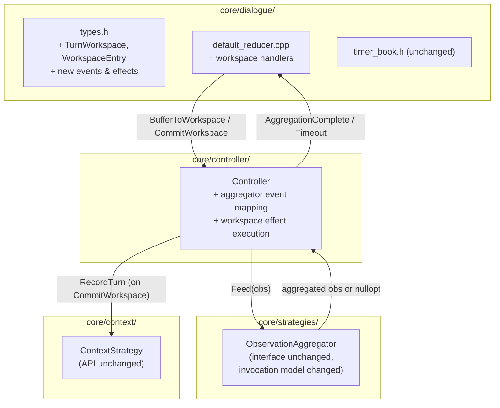
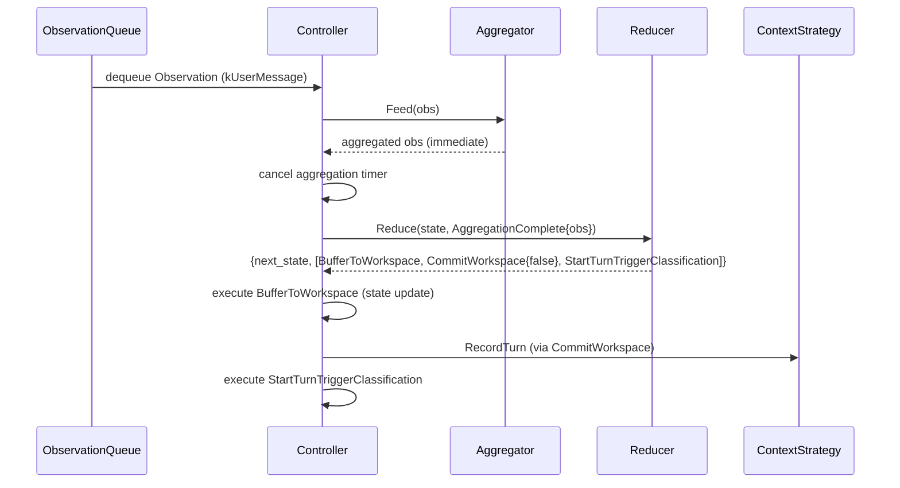
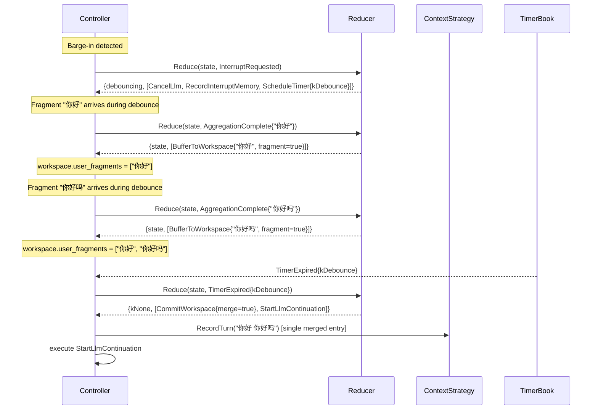

# Design Document: Dialogue Kernel Phase 3

## Overview

Phase 3 introduces a provisional turn workspace inside `DialogueState` and
event-izes the `ObservationAggregator`.  After Phase 3, the reducer controls
when user input and assistant output cross the boundary from provisional
workspace into committed history.  Debounce fragments are merged before
commit, producing cleaner LLM context.  The aggregator's buffer/flush/timeout
behavior becomes visible to the reducer as typed events.

**Scope boundary:** Phase 3 does NOT introduce agenda, mixed-initiative,
clarification, or playback lifecycle events (Phase 4).  It does NOT change
the `ContextStrategy` public API.  The workspace is entirely internal to
`dialogue/` state and `Controller` effect execution.

**Key design decision:** The workspace lives in `DialogueState`, not in
`ContextStrategy`.  `ContextStrategy` keeps its current "write = committed"
semantics.  The reducer produces `CommitWorkspace` effects to promote entries.
This minimizes changes to `context/` and keeps the commit boundary under the
kernel's control.

## Architecture

Phase 3 deepens `core/dialogue/` by adding workspace types and three new
effects, then rewires the Controller's aggregator and memory-recording paths.



## Components and Interfaces

### Component 1: Workspace Types (`core/dialogue/types.h`)

```cpp
// A single entry in the provisional workspace.
struct WorkspaceEntry {
  std::string content;
  std::string source;
  MemoryEntryType entry_type;
  std::chrono::steady_clock::time_point timestamp;
};

// Provisional turn workspace — holds data that has not yet been committed
// to ContextStrategy.
struct TurnWorkspace {
  // Buffered user input fragments (accumulated during debounce or
  // aggregation).  Merged into a single MemoryEntry on CommitWorkspace
  // when merge_fragments is true.
  std::vector<WorkspaceEntry> user_fragments;

  // In-progress assistant output.  Set when the reducer knows an assistant
  // response is being prepared but not yet committed.  Cleared on commit
  // or discard.
  std::optional<WorkspaceEntry> assistant_partial;
};
```

**Design rationale:** `WorkspaceEntry` is intentionally simpler than
`MemoryEntry`.  It carries only the fields needed for merging and commit
decisions.  The full `MemoryEntry` (with `item_json`, `tool_calls_json`,
etc.) is constructed at commit time by the effect executor, which has access
to `EnsureConversationItem` and `MemoryEntryFromItem`.

### Component 2: New Events (`core/dialogue/types.h`)

```cpp
// Raw user input fragment — before aggregation decides it's complete.
// Only used when the aggregator buffers (Feed returns nullopt).
// When Feed returns a value immediately (PassthroughAggregator), Controller
// skips this event and goes straight to UserMessageReceived.
struct UserFragmentReceived {
  Observation observation;
  std::chrono::steady_clock::time_point now;
};

// Aggregator decided the user is done speaking — the observation is the
// merged/complete result from Feed() or CheckTimeout().
struct AggregationComplete {
  Observation observation;
  std::chrono::steady_clock::time_point now;
};

// Aggregator timeout fired — force-flushed buffered content.
struct AggregationTimeout {
  Observation observation;
  std::chrono::steady_clock::time_point now;
};
```

**Updated DialogueEvent variant:**

```cpp
using DialogueEvent = std::variant<
    // Phase 1
    InterruptRequested,
    DebounceCooldownExpired,
    UserMessageReceived,
    ShutdownRequested,
    // Phase 2
    LlmCompleted,
    LlmFailed,
    ToolResultReceived,
    ToolCallTimeout,
    ContinuationRequested,
    SystemEventReceived,
    TimerExpired,
    TurnTriggerClassified,
    // Phase 3
    UserFragmentReceived,
    AggregationComplete,
    AggregationTimeout>;
```

**Note:** `UserMessageReceived` is retained for backward compatibility.
`AggregationComplete` and `AggregationTimeout` are the new primary ingress
events for user input.  The reducer handles them identically to
`UserMessageReceived` but with workspace integration.

### Component 3: New Effects (`core/dialogue/types.h`)

```cpp
struct BufferToWorkspace {
  WorkspaceEntry entry;
  bool is_fragment;  // true = user fragment, will be merged on commit
};

struct CommitWorkspace {
  bool merge_fragments;  // true = merge user_fragments into single entry
};

struct DiscardWorkspace {};
```

**Updated DialogueEffect variant** — add `BufferToWorkspace`,
`CommitWorkspace`, `DiscardWorkspace` to the existing variant.

### Component 4: TimerKind Extension

```cpp
enum class TimerKind {
  kDebounce,
  kToolCallTimeout,
  kConversationIdle,
  kAggregationTimeout,  // Phase 3: aggregator timeout
};
```

### Component 5: Updated DialogueState

```cpp
struct DialogueState {
  // --- Phase 1 + 2 fields (unchanged) ---
  bool conversation_active = false;
  CooldownPhase cooldown = CooldownPhase::kNone;
  int turn_count = 0;
  int total_prompt_tokens = 0;
  int total_completion_tokens = 0;
  int action_count = 0;
  std::chrono::steady_clock::time_point session_start;
  std::chrono::steady_clock::time_point last_activity;
  DeliberationPhase deliberation = DeliberationPhase::kIdle;
  uint64_t next_turn_trigger_id = 0;
  uint64_t pending_turn_trigger_id = 0;
  std::vector<std::string> pending_tool_call_ids;
  std::unordered_map<std::string, std::string> pending_tool_results;

  // --- Phase 3 addition ---
  TurnWorkspace workspace;
};
```

### Component 6: DefaultDialogueReducer — Updated Handlers

#### HandleUserMessage (updated)

The debounce path changes from `RecordMemory` to `BufferToWorkspace`:

```
// Debounce path (cooldown == kDebouncing):
//   Old: effects = [RecordMemory{obs}]
//   New: effects = [BufferToWorkspace{entry, is_fragment=true}]
//        next_state.workspace.user_fragments += entry
```

The normal path changes from `RecordMemory` to workspace-then-commit:

```
// Normal path (cooldown == kNone, deliberation == kIdle):
//   Old: effects = [RecordMemory{obs}, StartTurnTriggerClassification{...}]
//   New: effects = [BufferToWorkspace{entry, is_fragment=false},
//                   CommitWorkspace{merge_fragments=false},
//                   StartTurnTriggerClassification{...}]
```

The superseding path (kAwaitingTurnTrigger) follows the same pattern as
normal: buffer + commit + new classification.

#### HandleDebounceCooldownExpired (updated)

Before starting LLM continuation, commit the workspace:

```
// Old: effects = [StartLlmContinuation{now}]
// New: effects = [CommitWorkspace{merge_fragments=true},
//                 StartLlmContinuation{now}]
```

If the workspace has no user fragments (debounce expired with no new
messages), `CommitWorkspace` is still emitted but the effect executor
handles the empty case as a no-op.

#### HandleInterrupt (updated)

Discard uncommitted assistant output, commit user fragments:

```
// If workspace has user_fragments:
//   effects += [CommitWorkspace{merge_fragments=true}]
// If workspace has assistant_partial:
//   effects += [DiscardWorkspace{}]
// (Then existing interrupt effects: CancelLlm, RecordInterruptMemory, etc.)
```

**Important ordering:** workspace effects come BEFORE `CancelLlm` and
`RecordInterruptMemory` so that user fragments are preserved in committed
history before the interrupt entry is written.

#### HandleAggregationComplete / HandleAggregationTimeout (new)

These are thin wrappers that construct a `UserMessageReceived`-equivalent
event and delegate to `HandleUserMessage`:

```cpp
DialogueDecision HandleAggregationComplete(
    const DialogueState& state,
    const AggregationComplete& event) const {
  // Treat as a complete user message.
  UserMessageReceived msg{event.observation, event.now};
  return HandleUserMessage(state, msg);
}

DialogueDecision HandleAggregationTimeout(
    const DialogueState& state,
    const AggregationTimeout& event) const {
  // Treat as a complete user message (timeout-flushed).
  UserMessageReceived msg{event.observation, event.now};
  return HandleUserMessage(state, msg);
}
```

#### HandleUserFragmentReceived (new)

When the aggregator buffers a fragment (Feed returns nullopt), the reducer
records it in the workspace but does NOT start classification:

```cpp
DialogueDecision HandleUserFragmentReceived(
    const DialogueState& state,
    const UserFragmentReceived& event) const {
  auto next = state;
  next.last_activity = event.now;
  next.conversation_active = true;

  WorkspaceEntry entry;
  entry.content = event.observation.content;
  entry.source = event.observation.source;
  entry.entry_type = MemoryEntryType::kUserMessage;
  entry.timestamp = event.now;
  next.workspace.user_fragments.push_back(entry);

  return {next, {BufferToWorkspace{entry, true}}};
}
```

### Component 7: Controller Changes

#### RunLoop — Aggregator Event Mapping

The current aggregator call site in RunLoop:

```cpp
// Current (Phase 2):
auto aggregated = observation_aggregator_->Feed(obs);
if (!aggregated.has_value()) {
  // buffered — wait for more
  continue;
}
// ... construct UserMessageReceived, call Reduce ...
```

Changes to:

```cpp
// Phase 3:
auto aggregated = observation_aggregator_->Feed(obs);
if (!aggregated.has_value()) {
  // Fragment buffered by aggregator.
  // Optionally: feed UserFragmentReceived to reducer for workspace tracking.
  // Schedule aggregation timeout timer.
  auto now = std::chrono::steady_clock::now();
  timer_book_.Schedule(dialogue::TimerKind::kAggregationTimeout,
                       "aggregation",
                       now + aggregation_timeout_);
  // Emit buffering activity.
  EmitActivity(ActivityKind::kBufferingInput, obs.content);
  continue;
}
// Aggregator returned complete observation — cancel timeout timer.
timer_book_.Cancel("aggregation");
auto now = std::chrono::steady_clock::now();
dialogue::AggregationComplete agg_event{*aggregated, now};
auto decision = reducer_->Reduce(dialogue_state_, agg_event);
ApplyDialogueDecision(decision);
```

The aggregator timeout path (currently `CheckTimeout()` in the wait loop):

```cpp
// Phase 3: TimerExpired{kAggregationTimeout} fires from TimerBook.
// In the timer expired handler:
case TimerKind::kAggregationTimeout: {
  auto timeout_obs = observation_aggregator_->CheckTimeout();
  if (timeout_obs.has_value()) {
    dialogue::AggregationTimeout timeout_event{*timeout_obs, now};
    auto decision = reducer_->Reduce(dialogue_state_, timeout_event);
    ApplyDialogueDecision(decision);
  }
  break;
}
```

#### ApplyDialogueDecision — New Effect Handlers

```cpp
[&](const dialogue::BufferToWorkspace& e) {
  // Pure state update — workspace is in dialogue_state_.
  // The reducer already updated next_state.workspace, so this is a no-op
  // in terms of external side effects.  The effect exists for explicitness
  // and to allow future logging/auditing.
},
[&](const dialogue::CommitWorkspace& e) {
  auto& ws = dialogue_state_.workspace;
  if (e.merge_fragments && !ws.user_fragments.empty()) {
    // Merge all user fragments into a single MemoryEntry.
    std::string merged_content;
    std::string merged_source;
    auto latest_ts = ws.user_fragments.front().timestamp;
    for (const auto& frag : ws.user_fragments) {
      if (!merged_content.empty()) merged_content += " ";
      merged_content += frag.content;
      merged_source = frag.source;  // Use last source.
      if (frag.timestamp > latest_ts) latest_ts = frag.timestamp;
    }
    Observation merged_obs;
    merged_obs.type = ObservationType::kUserMessage;
    merged_obs.content = merged_content;
    merged_obs.source = merged_source;
    merged_obs.timestamp = latest_ts;
    MemoryEntry entry = MemoryEntryFromItem(
        MemoryEntryType::kUserMessage,
        EnsureConversationItem(merged_obs), latest_ts);
    context_.RecordTurn(session_id_, entry);
  } else if (!e.merge_fragments) {
    for (const auto& frag : ws.user_fragments) {
      Observation frag_obs;
      frag_obs.type = ObservationType::kUserMessage;
      frag_obs.content = frag.content;
      frag_obs.source = frag.source;
      frag_obs.timestamp = frag.timestamp;
      MemoryEntry entry = MemoryEntryFromItem(
          MemoryEntryType::kUserMessage,
          EnsureConversationItem(frag_obs), frag.timestamp);
      context_.RecordTurn(session_id_, entry);
    }
  }
  if (ws.assistant_partial.has_value()) {
    Observation asst_obs;
    asst_obs.type = ObservationType::kContinuation;
    asst_obs.content = ws.assistant_partial->content;
    asst_obs.source = ws.assistant_partial->source;
    asst_obs.timestamp = ws.assistant_partial->timestamp;
    MemoryEntry entry = MemoryEntryFromItem(
        MemoryEntryType::kAssistantMessage,
        EnsureConversationItem(asst_obs),
        ws.assistant_partial->timestamp);
    context_.RecordTurn(session_id_, entry);
  }
  // Clear workspace.
  ws.user_fragments.clear();
  ws.assistant_partial.reset();
},
[&](const dialogue::DiscardWorkspace&) {
  dialogue_state_.workspace.user_fragments.clear();
  dialogue_state_.workspace.assistant_partial.reset();
},
```

## Sequence Diagrams

### Normal User Message (Phase 3)



### Debounce Fragment Merging (Phase 3)



## Correctness Properties

### Property 1: Reducer purity (extended for Phase 3)

For any valid `DialogueState` (including workspace) and `DialogueEvent`
(including Phase 3 events), calling `Reduce(state, event)` twice with
identical inputs SHALL produce identical `DialogueDecision` outputs.

### Property 2: Workspace cleared after commit

For any `DialogueState` and any event sequence that produces a
`CommitWorkspace` effect, the `next_state.workspace.user_fragments` SHALL be
empty and `next_state.workspace.assistant_partial` SHALL be nullopt after the
effect is applied.

### Property 3: Debounce fragments accumulate

For any `DialogueState` where `cooldown == kDebouncing`, and any sequence of
`UserMessageReceived` (or `AggregationComplete`) events, each event SHALL
append to `next_state.workspace.user_fragments` and SHALL NOT produce
`CommitWorkspace` or `RecordMemory`.

### Property 4: Debounce expiry commits merged fragments

For any `DialogueState` where `cooldown == kDebouncing` and
`workspace.user_fragments` is non-empty, `DebounceCooldownExpired` (or
`TimerExpired{kDebounce}`) SHALL produce `CommitWorkspace{merge=true}` in
the effects list.

### Property 5: Normal message commits immediately

For any `DialogueState` where `cooldown == kNone` and
`deliberation == kIdle`, and any `UserMessageReceived` (or
`AggregationComplete`), effects SHALL contain both `BufferToWorkspace` and
`CommitWorkspace{merge=false}`.

### Property 6: Interrupt discards assistant partial

For any `DialogueState` where `workspace.assistant_partial` is present, and
any `InterruptRequested` event, effects SHALL contain `DiscardWorkspace`.

### Property 7: Fragment merging produces single entry

For any `CommitWorkspace{merge=true}` execution with N > 0 user fragments,
the effect executor SHALL call `RecordTurn` exactly once with content equal
to the space-joined concatenation of all fragment contents.

## Migration Strategy

Phase 3 is implemented incrementally:

1. **Add workspace types** — `WorkspaceEntry`, `TurnWorkspace` in `types.h`.
   Add new events and effects to the variants.  Existing code compiles
   unchanged because the workspace field has default initialization.

2. **Update reducer handlers** — Change `HandleUserMessage` debounce path
   from `RecordMemory` to `BufferToWorkspace`.  Change
   `HandleDebounceCooldownExpired` to emit `CommitWorkspace` before
   continuation.  Change normal path to buffer+commit.  Add
   `HandleAggregationComplete`, `HandleAggregationTimeout`,
   `HandleUserFragmentReceived`.

3. **Add effect handlers** — Implement `BufferToWorkspace`,
   `CommitWorkspace`, `DiscardWorkspace` in `ApplyDialogueDecision`.

4. **Rewire RunLoop aggregator** — Replace inline aggregator calls with
   event mapping.  Add `kAggregationTimeout` to `TimerKind`.  Schedule/cancel
   aggregation timers.

5. **Update interrupt handler** — Add workspace commit/discard before
   existing interrupt effects.

6. **Tests** — Unit tests for workspace operations, fragment merging,
   aggregator event-ization.  Property tests for workspace invariants.
   Controller-level regression test for debounce merging.

Each step preserves compilation and existing test passage.
