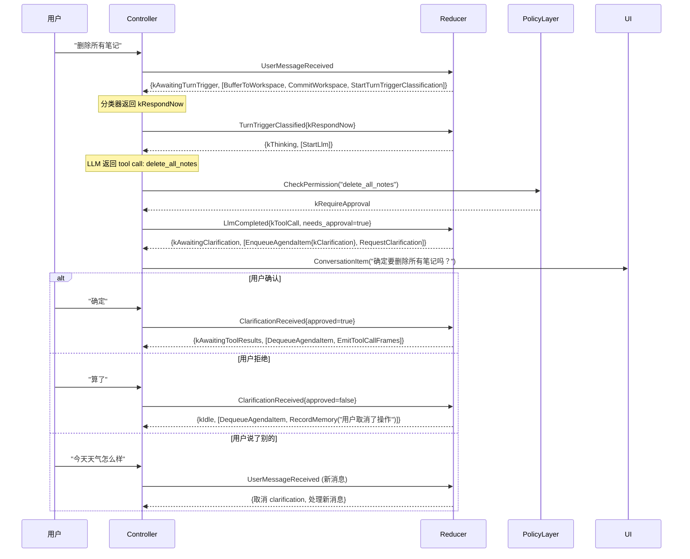
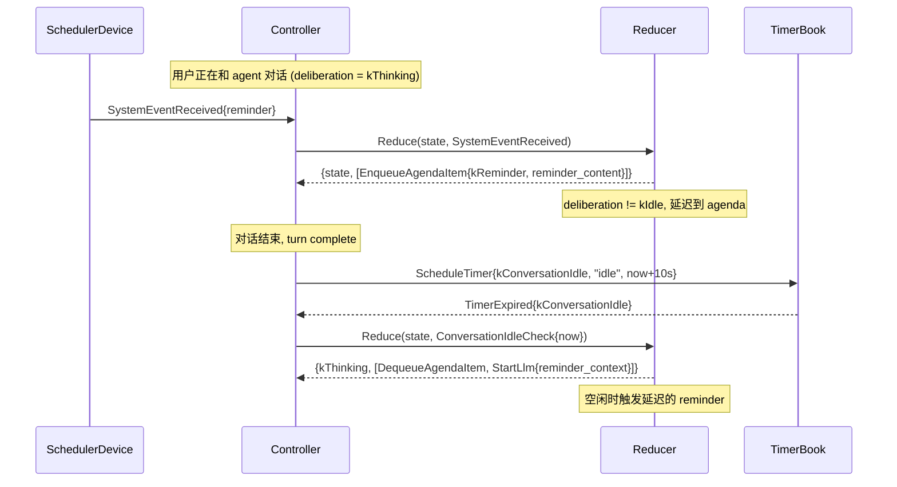
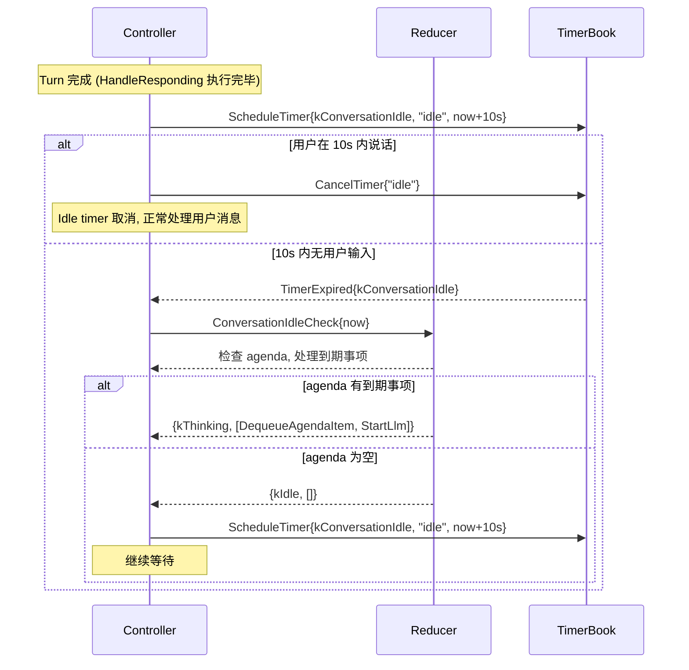

# 设计文档：对话内核 Phase 4 — Agenda 与混合主动

## 概述

Phase 4 在 `DialogueState` 中引入 `AgendaState` 子状态，让 reducer 能够
跟踪待处理事项（clarification、followup、reminder、proactive）并在合适时机
触发它们。同时启用 `kConversationIdle` timer，让 agent 在对话空闲时检查
agenda 并主动发起行为。

**核心设计原则：** agenda 是 reducer 的内部状态，不是外部存储。所有 agenda
操作都是纯状态转换。效果执行器负责将 agenda 决策转化为外部行为（UI 通知、
LLM 调用等）。

**实现顺序：** Delayed Reminder（最简单）→ Conversation Idle Timer →
Clarification（产品价值最高）→ Followup（依赖持久化）。

## 架构

Phase 4 不新增模块，只扩展 `core/dialogue/` 的类型和 reducer 逻辑。

```
core/dialogue/
  types.h          ← + AgendaState, AgendaItem, AgendaKind
                     + 新事件: ClarificationReceived, AgendaItemDue, ConversationIdleCheck
                     + 新效果: RequestClarification, EnqueueAgendaItem, DequeueAgendaItem, EmitProactiveMessage
  default_reducer  ← + HandleClarificationReceived, HandleConversationIdleCheck, HandleAgendaItemDue
                     + 修改 HandleSystemEvent (忙时延迟到 agenda)
                     + 修改 HandleLlmCompleted (tool call 需确认时进入 clarification)
```

## 组件与接口

### 组件 1：Agenda 类型 (`core/dialogue/types.h`)

```cpp
enum class AgendaKind {
  kClarification,  // 需要用户确认的操作
  kFollowup,       // 待跟进事项
  kReminder,       // 延迟的系统提醒
  kProactive,      // agent 主动发起的话题
};

struct AgendaItem {
  std::string id;                                      // 唯一标识
  AgendaKind kind;
  std::string topic;                                   // 事项描述
  int priority = 0;                                    // 优先级（高值优先）
  std::optional<std::chrono::steady_clock::time_point> deadline;  // 到期时间
  std::string context;                                 // 关联上下文（如 pending action JSON）
};

struct AgendaState {
  std::vector<AgendaItem> pending_items;               // 按 priority 降序
  std::optional<AgendaItem> active_item;               // 当前正在处理的事项
};
```

**设计决策：**
- `pending_items` 用 `std::vector` 而不是 `std::priority_queue`，因为
  reducer 需要遍历检查到期事项，priority_queue 不支持遍历。
- `active_item` 表示当前正在等待用户回复的 clarification 或正在执行的
  proactive turn。同一时间只能有一个 active item。
- `context` 字段存储序列化的 ActionCandidate JSON（用于 clarification）
  或 followup 内容。

### 组件 2：新事件

```cpp
// 用户对 clarification 请求的回复
struct ClarificationReceived {
  std::string item_id;       // 对应的 AgendaItem id
  bool approved;             // 用户是否确认
  std::string user_response; // 用户的回复文本（可选）
  std::chrono::steady_clock::time_point now;
};

// Agenda 事项到期（由 idle check 触发）
struct AgendaItemDue {
  std::string item_id;
  std::chrono::steady_clock::time_point now;
};

// 对话空闲检查（idle timer 触发）
struct ConversationIdleCheck {
  std::chrono::steady_clock::time_point now;
};
```

### 组件 3：新效果

```cpp
// 向用户发送确认请求
struct RequestClarification {
  std::string question;
  std::string pending_action_id;  // AgendaItem id
};

// 将事项加入 agenda
struct EnqueueAgendaItem {
  AgendaItem item;
};

// 从 agenda 移除事项
struct DequeueAgendaItem {
  std::string item_id;
};

// Agent 主动发送消息
struct EmitProactiveMessage {
  std::string content;
  std::string source;
};
```

### 组件 4：新增 DeliberationPhase

```cpp
enum class DeliberationPhase {
  kIdle,
  kAwaitingTurnTrigger,
  kThinking,
  kAwaitingToolResults,
  kAwaitingClarification,  // Phase 4: 等待用户确认
};
```

### 组件 5：ControllerConfig 扩展

```cpp
struct ControllerConfig {
  // ... 现有字段 ...
  std::chrono::seconds conversation_idle_check{10};  // 空闲检查间隔
};
```

## 时序图

### Clarification 流程



### Delayed Reminder 流程



### Conversation Idle Check 流程



## 数据模型

### DialogueState 字段映射（Phase 4 新增）

| 新字段 | 类型 | 说明 |
|--------|------|------|
| `agenda` | `AgendaState` | 待处理事项队列 |
| `agenda.pending_items` | `vector<AgendaItem>` | 按优先级排序的待办事项 |
| `agenda.active_item` | `optional<AgendaItem>` | 当前正在处理的事项 |

### AgendaItem 优先级规则

| AgendaKind | 默认优先级 | 说明 |
|------------|-----------|------|
| kClarification | 100 | 最高——用户正在等待确认 |
| kReminder | 50 | 中等——系统提醒 |
| kFollowup | 30 | 较低——跟进事项 |
| kProactive | 10 | 最低——agent 主动话题 |

### 事件 → Reducer Handler 映射

| 事件 | Handler | Phase |
|------|---------|-------|
| `ClarificationReceived` | `HandleClarificationReceived` | 4 |
| `ConversationIdleCheck` | `HandleConversationIdleCheck` | 4 |
| `AgendaItemDue` | `HandleAgendaItemDue` | 4 |
| `SystemEventReceived` (忙时) | `HandleSystemEvent` (修改) | 4 |
| `LlmCompleted` (需确认) | `HandleLlmCompleted` (修改) | 4 |

## 正确性属性

### 属性 1：Reducer 纯度

对任意有效的 `DialogueState`（包含 agenda）和 `DialogueEvent`（包含 Phase 4
事件），调用 `Reduce(state, event)` 两次应产生相同的 `DialogueDecision`。

### 属性 2：Agenda 不变量

对任意 `Reduce` 产生的 `next_state`：
- 如果 `deliberation == kAwaitingClarification`，则 `agenda.active_item`
  必须有值且 `kind == kClarification`
- `pending_items` 必须按 priority 降序排列
- `active_item` 和 `pending_items` 中不应有相同 id 的条目

### 属性 3：Clarification 取消安全

对任意处于 `kAwaitingClarification` 的状态，如果收到 `UserMessageReceived`
（非确认回复），reducer 应取消当前 clarification（清除 active_item）并正常
处理新消息。不应有悬挂的 clarification 状态。

### 属性 4：Delayed Reminder 不丢失

对任意 `SystemEventReceived` 在 `deliberation != kIdle` 时到达，该 reminder
必须出现在 `next_state.agenda.pending_items` 中。不应被静默丢弃。

### 属性 5：Idle Check 幂等

对任意处于 `kIdle` 且 agenda 为空的状态，`ConversationIdleCheck` 应返回
状态不变、效果为空。

### 属性 6：Clarification 确认恢复正确状态

对任意处于 `kAwaitingClarification` 的状态，`ClarificationReceived{approved=true}`
应恢复到 `kAwaitingToolResults` 并产生 `EmitToolCallFrames` 效果。

## 迁移策略

Phase 4 分步实现：

1. **添加 agenda 类型** — AgendaState、AgendaItem、AgendaKind 到 types.h。
   新事件和效果加入变体。现有代码因默认初始化不受影响。

2. **启用 Conversation Idle Timer** — 在 HandleResponding 后调度 idle timer，
   在用户输入时取消。添加 HandleConversationIdleCheck（agenda 为空时 no-op）。
   这一步不改变任何现有行为。

3. **实现 Delayed Reminder** — 修改 HandleSystemEvent：`deliberation != kIdle`
   时入队 agenda 而不是立即 StartLlm。HandleConversationIdleCheck 检查到期
   reminder 并触发。

4. **实现 Clarification** — 修改 HandleLlmCompleted 的 kToolCall 分支：
   如果 policy 返回 kRequireApproval，进入 kAwaitingClarification。添加
   HandleClarificationReceived。添加 ClarificationReceived 事件的 Controller
   入口（从用户消息中识别确认/拒绝意图，或通过 UI 按钮回调）。

5. **实现 Followup** — 添加 followup tool 调用时的 agenda 入队逻辑。
   HandleConversationIdleCheck 检查到期 followup。

6. **测试** — 每步添加对应的单元测试和 property test。

每一步都保持编译通过和现有测试通过。
