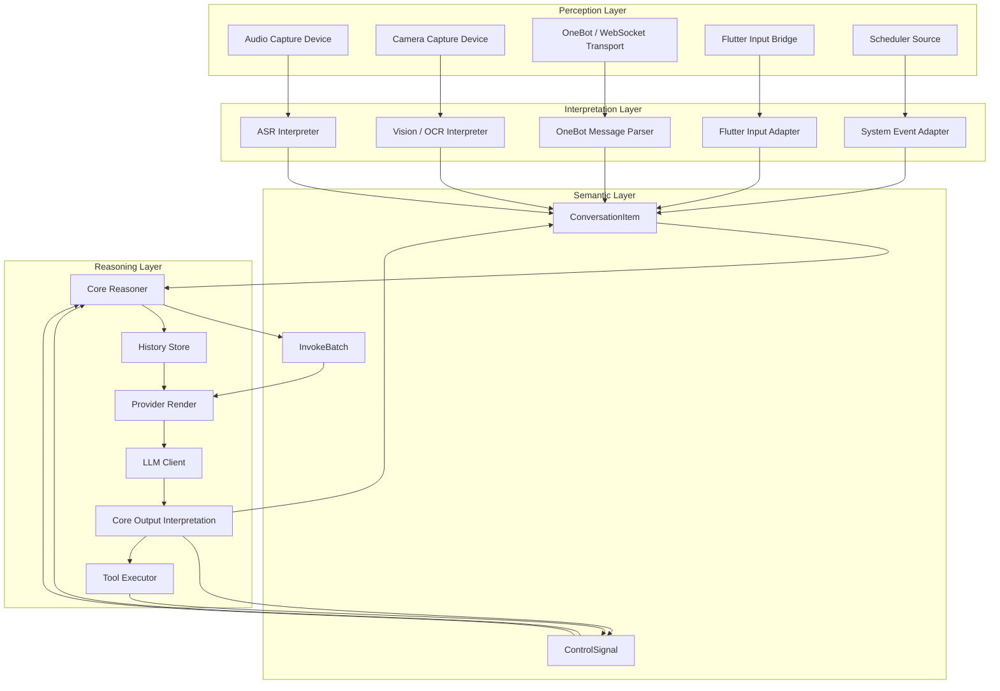
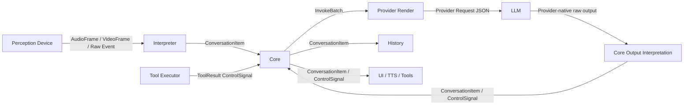
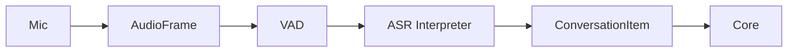
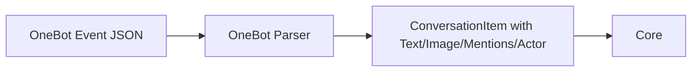
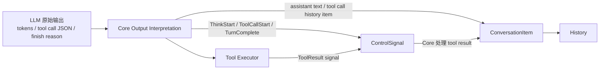

# 设计文档：统一语义 Pipeline

## 概述

本文档定义 Shizuru 下一代统一 pipeline 的架构设计。目标不是继续修补
`DataFrame -> Observation -> WorkspaceEntry -> MemoryEntry -> ContextMessage`
这一串旧类型，而是明确新的分层：

- **Perception 层**：感知外部世界的原始信号
- **Interpretation 层**：理解原始信号并产出语义对象
- **Semantic 层**：统一的 `ConversationItem` / `InvokeBatch` / `ControlSignal`
- **Reasoning 层**：Core、History、Provider Render、LLM、Tool 执行

本次重构是一次明确的架构改写，不是局部数据结构整理。

## 架构原则

1. 原始信号和语义对象必须分层，不能混用。
2. `ConversationItem` 是解释层的一次最终解释结果。
3. `ConversationItem` 是 source-final 的，不负责等待后续输入，也不负责跨消息聚合。
4. `InvokeBatch` 才是一次 LLM 调用的输入单位。
5. Provider payload 只是终端投影，不是内部真相。
6. 输入方向有 interpretation，输出方向同样需要 interpretation。

## 总体分层



## 各层职责

### 1. Perception 层

Perception device 只负责感知和传输原始世界信号，不负责对话语义解释。

典型组件：

- 音频采集
- 视频采集
- OneBot / WebSocket transport
- Flutter 原始输入桥接

原始信号示例：

```cpp
struct AudioFrame {
  std::vector<int16_t> samples;
  int sample_rate = 16000;
  std::chrono::steady_clock::time_point timestamp;
};

struct VideoFrame {
  std::vector<uint8_t> bytes;
  std::string pixel_format;
  int width = 0;
  int height = 0;
  std::chrono::steady_clock::time_point timestamp;
};
```

### 2. Interpretation 层

每个输入域有自己的 interpreter / adapter：

- ASR：把音频解释成最终文本表达
- OneBot parser：把 QQ message segments 解释成语义消息
- Flutter adapter：把 UI 输入解释成语义消息
- Scheduler adapter：把系统事件解释成语义事件
- Vision/OCR：未来把图像帧解释成语义内容

所有 interpreter 输出统一收敛为：

- `ConversationItem`

### 3. Semantic 层

Semantic 层只定义统一语义对象：

- `ConversationItem`
- `InvokeBatch`
- `ControlSignal`

这些类型是 Core 及其上下游共享的架构边界。

### 4. Reasoning 层

Reasoning 层负责：

- batching / flush / invoke 决策
- history commit
- provider payload render
- LLM 调用
- tool 调度与回传
- 输出方向的语义解释

## 核心类型

### ContentPart

`ContentPart` 是最小内容/协议片段。

```cpp
struct TextPart {
  std::string text;
};

struct ImagePart {
  std::string url;
};

struct AudioPart {
  std::vector<uint8_t> data;
  std::string format;
};

struct ToolCallPart {
  std::string tool_call_id;
  std::string name;
  std::string arguments_json;
};

struct ToolResultPart {
  std::string tool_call_id;
  std::string tool_name;
  bool success = true;
  std::string result_json;
};

using ContentPart = std::variant<
    TextPart,
    ImagePart,
    AudioPart,
    ToolCallPart,
    ToolResultPart>;

using ContentParts = std::vector<ContentPart>;
```

说明：

- `ContentPart` 不是完整语义对象
- 它只表示内容或协议片段
- `ToolCallPart` / `ToolResultPart` 进入同一个容器，但它们不是普通内容模态

### ConversationItem

`ConversationItem` 表示解释层产出的一次 **source-final** 最终解释结果。

```cpp
enum class ActorKind {
  kHuman,
  kAssistant,
  kSystem,
  kTool,
};

enum class ConversationItemKind {
  kUserMessage,
  kAssistantMessage,
  kSystemEvent,
  kToolCall,
  kToolResult,
};

struct ActorRef {
  std::string actor_id;
  std::string display_name;
  ActorKind kind = ActorKind::kHuman;
};

struct ConversationItem {
  std::string item_id;
  std::string conversation_id;
  ConversationItemKind kind = ConversationItemKind::kUserMessage;
  ActorRef actor;
  ContentParts parts;
  std::chrono::system_clock::time_point wall_time;
  std::optional<std::string> reply_to_item_id;
  std::vector<std::string> mentions;
};
```

约束：

- `ConversationItem` 不包含通用 `annotations` / `extensions` 垃圾桶字段
- 新的结构化语义优先通过新增显式字段、`ContentPart` 或新的 `ConversationItemKind` 表达
- 如果源头产生多个最终事件，它们应表示为多个**有序的** `ConversationItem`

### kind 与 parts 的约束

- `kUserMessage`
  - 允许：`TextPart`、`ImagePart`、`AudioPart`
  - 不允许：`ToolCallPart`、`ToolResultPart`
- `kAssistantMessage`
  - 允许：`TextPart`、`ImagePart`、`AudioPart`
  - 不允许：`ToolCallPart`、`ToolResultPart`
- `kSystemEvent`
  - 通常允许：`TextPart`
  - 可选允许：`ImagePart`、`AudioPart`（仅在明确业务需要时）
  - 不允许：`ToolCallPart`、`ToolResultPart`
- `kToolCall`
  - 允许：一个或多个 `ToolCallPart`
  - 不允许：`TextPart`、`ImagePart`、`AudioPart`、`ToolResultPart`
- `kToolResult`
  - 允许：一个或多个 `ToolResultPart`
  - 不允许：`TextPart`、`ImagePart`、`AudioPart`、`ToolCallPart`

补充：

- 多个并行 tool call 应表示为一个 `kToolCall` item，其中 `parts` 含多个 `ToolCallPart`
- 多个 tool result 也可以表示为一个 `kToolResult` item，其中 `parts` 含多个 `ToolResultPart`
- 但 `ToolCallPart` 与 `ToolResultPart` 不应在同一个 `ConversationItem` 中交错混装

### InvokeBatch

`InvokeBatch` 是一次 LLM 调用的输入单位。

```cpp
enum class TriggerReason {
  kUserFlush,
  kDebounceTimeout,
  kToolContinuation,
  kSystemEvent,
  kIdlePrompt,
};

struct InvokeBatch {
  std::string conversation_id;
  std::vector<ConversationItem> items;
  TriggerReason reason = TriggerReason::kUserFlush;
  std::chrono::steady_clock::time_point created_at;
};
```

说明：

- `ConversationItem` 是语义事件
- `InvokeBatch` 是一次 LLM 调用的批处理单元
- 一个 batch 可以包含多个有序的 `ConversationItem`

### ControlSignal

`ControlSignal` 表示控制面事件，而不是内容语义对象。

包括但不限于：

- `Flush`
- `Cancel`
- `Interrupt`
- `ThinkStart`
- `ToolCallStart`
- `FinalAnswerStart`
- `TurnComplete`
- `ToolResult`

## Provisional 状态在哪里

系统仍然需要处理：

- ASR partial transcript
- debounce fragments
- interrupted assistant output

但这些状态不是一等架构实体。

约束：

- `PendingContribution` 之类的 provisional 状态只存在于 interpreter 的私有逻辑内部
- 它们不暴露给 Core
- Core 只接收最终的 `ConversationItem`
- 对于天然 final 的输入源（例如 OneBot 单条消息、Flutter 点击发送），解释层不得再引入额外等待窗口

## 节点通信矩阵



通信规则：

- perception -> interpreter：原始信号类型
- interpreter -> core：`ConversationItem`
- core -> provider render：`InvokeBatch`
- LLM raw output -> core output interpretation：provider-native raw output
- tool executor -> core：`ControlSignal`

额外规则：

- Tool Executor 只回传 `ControlSignal`
- `kToolResult` 类型的 `ConversationItem` 由 Core 收到 tool result signal 后构造
- assistant 输出方向的 `ConversationItem` 由 Core 对 LLM 原始输出解释后构造

## 场景映射

### 语音对话



说明：

- 原始音频不会天然携带 actor 身份
- actor 身份在 interpretation 边界补上
- 只有 interpreter 判定 utterance 完成后，ASR 输出才能升格为 `ConversationItem`
- ASR partial token / provisional transcript 不进入 Core

### QQ / OneBot 聊天



说明：

- OneBot parsing 天然就是语义化过程
- actor、mentions、media 在 parse 时就已知
- parse 完成后不应再被压平成 metadata string
- 单条 OneBot 消息天然是 source-final，应立即产出 `ConversationItem`
- 是否将多条 `ConversationItem` 组成一次 LLM 调用，由 Core 的 batching 逻辑决定
- 如果群聊中 A、B、A 三条消息按顺序到达，它们应表示为三个有序的 `ConversationItem`

### Flutter 输入


### LLM 输出与 Tool 执行



说明：

- LLM 原始输出不是 `ConversationItem`
- Core 内部负责 output interpretation
- Tool Executor 只产生 tool result signal，不直接写 history
- Core 收到 tool result signal 后构造 `kToolResult` 的 `ConversationItem`

## 迁移策略

### Phase 1：定义新的语义模型

- 定义规范的 `ContentPart`
- 定义规范的 `ConversationItem`
- 定义规范的 `InvokeBatch`
- 明确 raw-signal 与 semantic-input 的边界

### Phase 2：让 interpreter 输出语义对象

- OneBot parser 输出 `ConversationItem`
- Flutter input adapter 输出 `ConversationItem`
- ASR output adapter 在最终结果产生时输出 `ConversationItem`
- scheduler adapter 输出 `ConversationItem`

### Phase 3：限制 Core 只接收语义输入

- Core 不再接收原始 message metadata 协议
- workspace / buffer / history 围绕 `ConversationItem` 收敛
- invoke 路径围绕 `InvokeBatch` 收敛

### Phase 4：统一输出解释与工具回传

- 将 LLM 原始输出统一纳入 Core output interpretation
- Tool Executor 只回传 control signal
- `kToolCall` / `kToolResult` history item 统一由 Core 构造

### Phase 5：清理 legacy 类型

- 删除 legacy observation/content duplication
- 删除从扁平字符串重建 message 的逻辑
- 仅在确实需要 signal processing 的位置保留 raw signal types

## 非目标

本次设计不要求：

- 把所有原始 transport 类型都替换成 `ConversationItem`
- 让音频/视频信号路径在 interpretation 之前强行携带 actor 身份
- 把 provider payload 类型直接当成 Core 内部模型
- 让所有 device 理解所有模态

## 架构总结

未来的 pipeline 应该是：

- **Perception devices perceive**
- **Interpreters understand**
- **ConversationItem expresses source-final meaning**
- **InvokeBatch groups meaning for one LLM call**
- **Core interprets output-side raw responses into semantic items and control signals**
- **Provider render projects internal meaning into vendor payloads**
