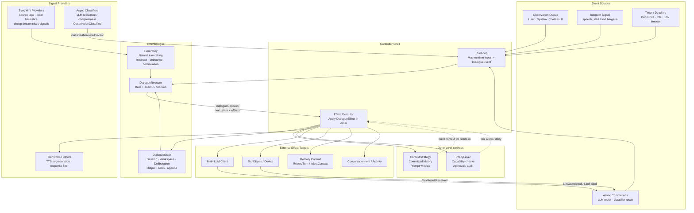

# Dialogue Kernel Proposal

## Status

Proposal for review.  This document defines the target internal structure of
`core/` needed to support richer, more natural dialogue behavior without
turning `Controller` into a monolithic branch-heavy state machine.

## Problem

The current `core/` pipeline is centered on a mostly linear path:

`observation -> aggregate -> filter -> think -> route -> act/respond`

This is sufficient for simple chat and basic voice input, but it becomes
fragile once the dialogue model must support:

- barge-in followed by debounce and continuation
- multiple input sources (`voice`, `text`, `scheduler`, tools)
- explicit internal events and timers
- turn workspaces that differ from committed history
- mixed-initiative behavior, clarifications, and follow-ups
- streaming output that may be interrupted before the turn is complete

The main issue is not the absence of states, but the absence of a dedicated
dialogue layer that owns semantic turn-taking decisions.

## Goals

- Keep `core/` as the only semantic decision center.
- Preserve the existing architecture boundary where `runtime/` is a pure bus.
- Make turn-taking, interrupt handling, continuation, and agenda management
  explicit and testable.
- Separate pure semantic state transitions from impure side effects.
- Allow the current controller behavior to be reproduced first, then evolved.

## Non-Goals

- Do not turn `services/`, `runtime/`, or `io/` into reducer-driven code.
- Do not introduce a general-purpose workflow engine or graph runtime.
- Do not move HTTP, memory persistence, tool execution, or audio playback
  logic into the dialogue kernel.

## Design Summary

`core/` should gain a dedicated `dialogue/` module.  The dialogue kernel owns
dialogue events, dialogue state, and reducer/effect decisions.  The existing
`Controller` remains, but its role narrows to:

- queueing inbound events
- invoking the dialogue reducer
- executing effects
- translating asynchronous completions back into dialogue events

In other words, `Controller` becomes an event loop shell around the dialogue
kernel instead of remaining the primary home of all turn-taking semantics.

## Target Design Diagram



- `TurnPolicy` owns workflow decisions such as ignore, buffer, interrupt,
  think now, think later, and commit timing.
- Sync hint providers supply cheap local evidence; they do not own the
  workflow.
- Async classifiers are effect-backed semantic workers; their results return
  as new `DialogueEvent`s.
- `Controller` remains the event loop shell and effect executor, not the
  semantic owner of turn-taking.

## Proposed Directory Layout

```text
core/
  dialogue/
    agenda.h
    effect.h
    event.h
    kernel.h
    reducer.h
    state.h
    timer_book.h
    turn_policy.h
    workspace.h
  controller/
  context/
  policy/
  strategies/
```

This document defines responsibilities, not the exact initial file list.  The
first implementation may collapse some headers if needed.

## Module Boundary

### dialogue/

Owns:

- dialogue event taxonomy
- dialogue state and sub-states
- turn workspace
- agenda and pending follow-up state
- turn-taking policy
- reducer logic from `(state, event)` to `(next_state, effects)`

Does not own:

- HTTP or SSE transport
- memory store implementations
- tool execution
- prompt rendering algorithms
- audio, ASR, TTS, or VAD

### controller/

Owns:

- thread-safe event queue
- event loop thread
- effect execution
- callback bridging
- cancellation plumbing

Does not own:

- long-term semantic policy
- hidden dialogue booleans that represent semantic state

### context/

Owns:

- committed history
- prompt window construction
- context budgeting
- summarization

Does not own:

- whether an observation should be committed yet
- debounce policy
- mixed-initiative turn policy

### policy/

Owns:

- capability checks
- approvals
- audit hooks

Does not own:

- conversation timing
- agenda selection
- voice turn-taking

### strategies/

Owns:

- pluggable signal providers and helpers
- input aggregation heuristics or classifiers
- relevance classification
- TTS segmentation
- response transformation

Does not own:

- the final semantic workflow of the turn

## Core Concepts

### DialogueEvent

The existing `Observation` type is too narrow for the full dialogue model.
The kernel needs a broader event taxonomy, for example:

- `ExternalObservationReceived`
- `ObservationClassified` — result of async classification (see below)
- `TimerExpired`
- `InterruptRequested`
- `LlmStarted`
- `LlmCompleted`
- `LlmFailed`
- `ToolResultReceived`
- `InternalReminderTriggered`

These events can wrap existing `Observation` payloads where appropriate.

Note: `LlmChunkReceived`, `PlaybackStarted`, `PlaybackStopped` are
intentionally omitted from the initial taxonomy.  Streaming token handling
belongs in the effect executor layer (see below), not in the reducer.
Playback lifecycle events can be added in Phase 4 when "wait until speech
finishes" policies are needed.

### DialogueState

Dialogue state should be explicit and multi-dimensional rather than encoded as
one flat enum plus several controller booleans.

Suggested shape:

```cpp
struct DialogueState {
  SessionState session;
  TurnWorkspace workspace;
  DeliberationState deliberation;
  OutputState output;
  ToolState tools;
  AgendaState agenda;
};
```

Important sub-states:

- **TurnWorkspace**: buffered user fragments, source attribution, debounce
  deadline, whether the data is committed or provisional.
- **DeliberationState**: whether an LLM request is in flight, which request
  it is, and why thinking was started.
- **OutputState**: whether assistant output is streaming, spoken, interrupted,
  or pending final commit.
- **ToolState**: pending tool calls, partial results, timeout windows.
- **AgendaState**: pending clarifications, follow-up topics, deferred intents.

### DialogueEffect

Semantic decisions should produce explicit effects instead of directly calling
subsystems from the reducer.

Examples:

- `StartObservationClassification` — async LLM-based input classification
- `RecordMemory`
- `CommitWorkspace` — promote provisional workspace entries to committed history
- `InjectContext`
- `ScheduleTimer`
- `CancelTimer`
- `StartLlm`
- `CancelLlm`
- `EmitToolCall`
- `EmitConversationItem` — push item to UI (streaming delta or final)
- `EmitTtsSegment`
- `AuditEvent`

Any operation that involves external I/O, blocking, or latency must be modeled
as an effect, never as a synchronous call inside the reducer.

## Reducer and Effect Model

The recommended contract is:

```cpp
struct DialogueDecision {
  DialogueState next_state;
  std::vector<DialogueEffect> effects;
};

class DialogueReducer {
 public:
  virtual DialogueDecision Reduce(const DialogueState& state,
                                  const DialogueEvent& event) = 0;
};
```

The reducer is pure.  It must not:

- talk to the network
- write to memory stores
- emit frames directly
- block on tool execution

Those actions happen in controller-owned effect execution, and the results come
back as new dialogue events.

## Strategies as Async Effect Workers

A key design principle: **any strategy that performs external I/O must be
modeled as an async effect, not a synchronous function call inside the
reducer.**

This implies a three-way split in the dialogue kernel:

1. **Sync hints** — fast, pure, local signals that can be computed
   immediately and passed into the reducer without any async round-trip.
2. **Async classifiers** — semantic judgments that may require external I/O
   (typically an LLM call) and therefore must be modeled as
   effect → completion-event pairs.
3. **Effect-backed semantic decisions** — actions chosen by the reducer
   itself, such as "start the main LLM turn", "commit workspace", or
   "schedule debounce timer".  These are not classifiers; they are explicit
   workflow decisions expressed as effects.

### The ObservationFilter Problem

The current pipeline calls `ObservationFilter::ShouldProcess(obs)` as a
synchronous gatekeeper inside the controller loop.  But `LlmObservationFilter`
calls the LLM to classify input relevance — this is an async I/O operation
that can take hundreds of milliseconds.

In the dialogue kernel model, this cannot remain a synchronous call inside the
reducer.  The correct decomposition is:

```
Reduce(state, ExternalObservationReceived{obs})
  → next_state = AwaitingObservationClassification{obs_id}
  → effects = [StartObservationClassification{obs_id, content, source}]

// ... effect executor calls LLM filter asynchronously ...

Reduce(state, ObservationClassified{obs_id, verdict})
  → if verdict == kProcess:  next_state = Thinking, effects = [StartLlm{...}]
  → if verdict == kIgnore:   next_state = Listening, effects = []
  → if verdict == kBuffer:   next_state = Listening (workspace stays open)
```

This preserves reducer purity while keeping the LLM-based classification
capability.  The `ObservationFilter` interface evolves from a synchronous
`bool ShouldProcess(obs)` into an async classification worker that the effect
executor invokes and whose result flows back as an `ObservationClassified`
event.

### Sync Hints

Not every decision input needs the async effect path.  The reducer can and
should consume cheap local signals directly.

Examples of sync hints:

- input source (`voice`, `text`, `scheduler`, `tool`)
- whether the current workspace is in post-barge-in debounce
- whether the incoming content is empty
- whether a timer deadline has already expired
- whether tool results are still pending
- deterministic heuristic tags from local strategies

These hints may come from:

- existing controller/runtime metadata
- pure strategy helpers
- reducer-owned derived state

Suggested contract:

```cpp
struct TurnHint {
  bool empty_input = false;
  bool post_barge_in = false;
  bool has_pending_tools = false;
  std::string source;
  std::vector<std::string> local_tags;
};
```

The important point is that sync hints are **evidence**, not authority.  They
help the reducer choose a path, but they do not own the workflow.

### Async Classifiers

Async classifiers answer questions whose semantics are expensive or uncertain
enough to justify a model call.

Examples:

- is this user input directed at the assistant?
- is this utterance clearly incomplete?
- should this internal reminder interrupt the current flow?
- should the agent clarify before acting?

Suggested event/effect pattern:

```cpp
StartObservationClassification{obs_id, classifier_kind, payload}
ObservationClassified{obs_id, classifier_kind, verdict, metadata}
CancelClassification{obs_id}
```

This makes async semantics explicit:

- the reducer knows classification is in flight
- interrupts or superseding input can cancel or invalidate it
- stale results can be discarded by id

### Effect-Backed Semantic Decisions

Some semantic steps are not "classify and wait", but "the dialogue policy has
already decided what to do next; now perform it".

Examples:

- `StartLlm`
- `CancelLlm`
- `CommitWorkspace`
- `ScheduleTimer`
- `EmitToolCall`
- `RecordMemory`

These are reducer outputs, not strategy outputs.  This distinction matters:

- a **classifier** provides evidence that may influence the next decision
- an **effect-backed decision** is the decision

Conflating the two would recreate the current problem where strategies appear
to own workflow instead of merely informing or executing it.

### General Principle

The same pattern applies to any strategy that needs external I/O:

- **Synchronous, pure strategies** (e.g., `TtsSegmentStrategy::ReadyLength()`,
  `ResponseFilter::Filter()`) can be called directly by the effect executor
  during effect execution.  They do not need the async event round-trip.
- **Async, I/O-bound strategies** (e.g., `LlmObservationFilter`,
  `LlmObservationAggregator`, any future LLM-based classifier) must be
  modeled as effect → result event pairs.

This is not a design conflict — it is the reason the effect model exists.

## Strategy Taxonomy

To keep interfaces stable, strategies should eventually be grouped by runtime
behavior rather than by historical name alone.

### Pure Synchronous Helpers

Properties:

- no external I/O
- no blocking
- deterministic for a given input
- callable directly by effect executor or reducer-adjacent code

Examples:

- punctuation-based TTS segmentation
- response text cleanup
- local heuristic tagging

### Async Semantic Workers

Properties:

- may use network I/O or model inference
- return later via completion event
- must carry correlation ids for cancellation and stale-result rejection

Examples:

- LLM-based observation filtering
- LLM-based endpointing / utterance-completion checks
- future relevance, clarification, or interruption classifiers

### Dialogue Policy

Properties:

- pure semantic transition logic
- owns workflow, timing, and commit decisions
- consumes hints and classifier results
- emits effects

Examples:

- barge-in handling
- debounce entry/exit
- continuation vs immediate think
- clarification before tool call
- whether to keep listening or respond now

This taxonomy is important because the current codebase uses the word
"strategy" for several very different things.  The dialogue kernel should make
those differences explicit rather than hiding them behind uniform-looking
interfaces.

## Streaming Token Handling

Streaming LLM output (per-token callbacks) is handled at the **effect executor
layer**, not inside the reducer.

When the reducer produces a `StartLlm` effect, the effect executor:

1. Calls `LlmClient::SubmitStreaming` with a token callback.
2. The token callback directly handles TTS segmentation, `EmitConversationItem`
   deltas, and `<think>` tag filtering — all within the effect executor thread.
3. When streaming completes, the executor translates the final result into an
   `LlmCompleted` (or `LlmFailed`) event and feeds it back to the reducer.

The reducer only sees turn-level events (`LlmCompleted`, `LlmFailed`), never
individual tokens.  This keeps the reducer fast and avoids per-token dispatch
overhead.

## Turn Policy

`dialogue/turn_policy.h` should become the home of semantic timing rules:

- whether to buffer or commit incoming user fragments
- how barge-in changes the turn
- whether to enter debounce after interruption
- when to think with a continuation
- whether to ask for clarification or continue gathering input

This is the correct place for natural-conversation behavior.  It should not
remain spread across `ObservationAggregator`, `ObservationFilter`, and
controller booleans.

## Workspace vs Committed History

The dialogue kernel should distinguish:

- **Turn workspace**: provisional input or output belonging to the current
  unfinished turn
- **Committed history**: memory entries guaranteed to be part of future prompt
  windows

Why this matters:

- interrupted assistant output may or may not be committed
- barge-in fragments may need to be buffered together before commit
- context building should not automatically see every provisional fragment

`context/` remains responsible for rendering committed history.  The dialogue
kernel decides when workspace content crosses the boundary and becomes a
committed memory entry.

Design decision: the dialogue kernel holds the workspace buffer internally.
`ContextStrategy` keeps its current "write = committed" semantics.  The
reducer produces `CommitWorkspace` effects when provisional data should be
promoted.  This minimizes changes to `context/` and keeps the commit boundary
under the kernel's control.

## Relationship to Existing Strategies

The current strategy interfaces remain useful, but their role and invocation
model changes:

- **ObservationAggregator** becomes an input signal provider.  If it is
  purely in-memory (e.g., `PassthroughAggregator`), it can be called
  synchronously by the effect executor.  If it uses LLM-based endpointing
  (e.g., `LlmObservationAggregator`), it becomes an async effect worker
  like `ObservationFilter`.
- **ObservationFilter** becomes an async classification effect worker.
  It no longer gates the pipeline synchronously.  The reducer decides what
  to do with the classification result.
- **TtsSegmentStrategy** remains a synchronous output helper, called by the
  effect executor during streaming token handling.
- **ResponseFilter** remains a synchronous final transformation helper,
  called by the effect executor when producing the response.

The dialogue kernel owns the semantic decision.  Strategies provide evidence
or perform transformations, but never control the workflow.

## Interaction With Current Controller

The migration target is:

1. `Controller` dequeues an event.
2. `Controller` passes `(state, event)` to the dialogue kernel.
3. The kernel returns `DialogueDecision`.
4. `Controller` updates state and executes effects.
5. Async completions are translated back into events.

This preserves the existing single-threaded reasoning loop while making
dialogue semantics explicit.

## Migration Plan

### Phase 1: Introduce the Shell

- add `dialogue/` types for event, state, effect, and decision
- keep existing behavior but model it through the new interfaces
- keep current `Controller` transitions intact
- first concrete win: move `post_interrupt_cooldown_` and barge-in logic
  into the reducer as explicit state + events, proving the pattern simplifies
  real code rather than adding an empty indirection layer

### Phase 2: Move Natural Conversation Into Turn Policy

- move barge-in + debounce + continuation logic out of ad-hoc controller flags
- introduce timer events rather than implicit polling-only behavior
- add explicit internal event types
- migrate `ObservationFilter` from synchronous gatekeeper to async
  classification effect (StartObservationClassification → ObservationClassified)

### Phase 3: Split Workspace From History

- add provisional turn workspace
- commit user and assistant entries intentionally rather than immediately
- update `ContextStrategy` inputs to distinguish committed history from the
  current workspace

### Phase 4: Add Agenda and Mixed-Initiative Behavior

- clarifications
- pending follow-ups
- delayed internal reminders
- multi-step agent-led turn management

## Benefits

- dialogue behavior becomes testable as pure state transitions
- turn-taking is no longer encoded in scattered booleans
- natural conversation features have a stable home
- tool use, timers, streaming, and interrupt handling compose more cleanly
- future parameters can be grouped by semantic policy instead of leaking into
  unrelated modules

## Risks

- introducing reducer/effect structure too aggressively can stall delivery
- poor event taxonomy can recreate the current complexity under new names
- mixing persistent history with provisional workspace can cause duplication if
  the commit boundary is not defined clearly

The migration must therefore be incremental and should preserve existing
behavior first.

## Review Questions

### Resolved

- **Is `dialogue/` the correct long-term owner of turn-taking semantics?**
  Yes.  The current Controller mixes event-loop mechanics with semantic
  decisions.  Separating them is the right call.

- **Should provisional workspace remain entirely in `dialogue/`, or should
  `context/` expose an explicit two-tier history API?**
  Workspace stays in `dialogue/`.  `ContextStrategy` keeps "write = committed"
  semantics.  The kernel produces `CommitWorkspace` effects to promote entries.

- **Which current controller branches should be the first to move into reducer
  logic after the shell is introduced?**
  `post_interrupt_cooldown_` and barge-in handling — they are self-contained,
  currently encoded as scattered booleans, and will demonstrate immediate
  simplification.

### Still Open

- **Should timer scheduling live as a first-class effect from the beginning?**
  Leaning toward no for Phase 1.  Continue using `wait_for` timeouts.
  Introduce `TimerBook` (min-heap of deadlines) in Phase 2 when explicit
  timer events are needed for debounce and conversation idle policies.

- **How should `AwaitingObservationClassification` handle interrupt?**
  If an interrupt arrives while classification is in flight, the reducer
  should transition to Listening and produce a `CancelClassification` effect.
  The stale `ObservationClassified` event (if it arrives later) should be
  discarded by checking the obs_id against the current workspace.
