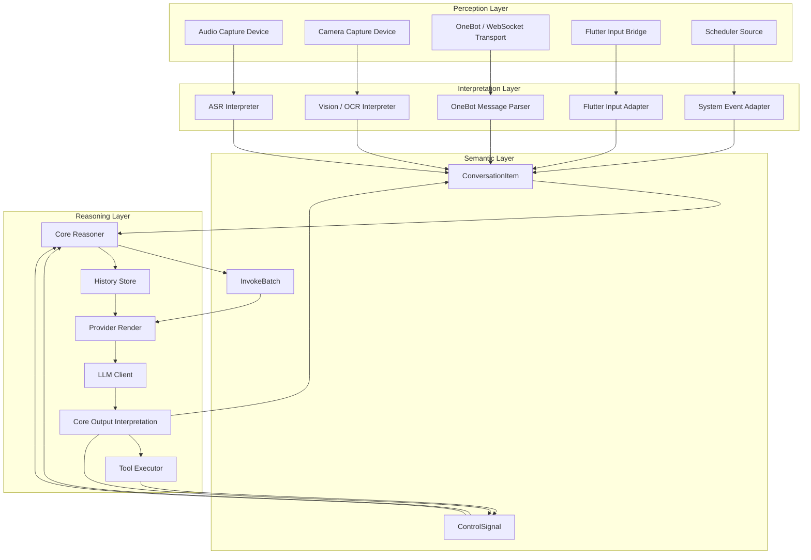
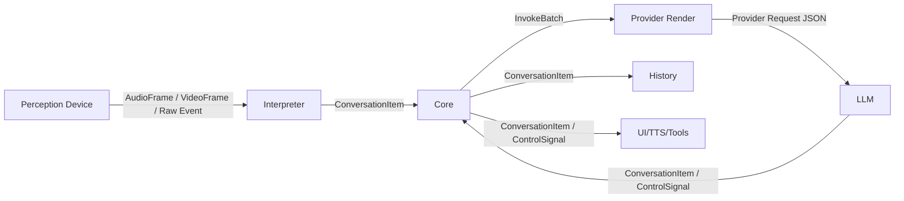
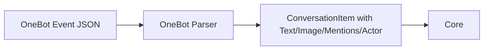
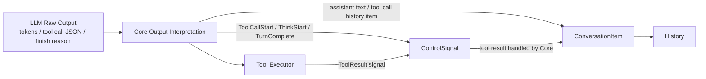

# 语义 Pipeline 架构指南

本文档定义了 Shizuru 在语义模型重构后的目标端到端 pipeline 架构。它取代了
“原始传输帧、中间 Observation、prompt 渲染对象同时作为 core 一等数据类型”
这一旧假设。

本次重构的核心架构决策是：

- **Perception devices 负责感知外部世界**
- **Interpreter nodes 负责理解原始输入并产出语义单元**
- **Core reasoning 只处理语义单元和控制信号**

这是一轮更大范围的架构重写，不是局部重构。

## 适用范围

本文档适用于：

- 多模态用户输入
- 群聊 / 富文本消息输入
- 语音输入
- 系统生成事件
- tool call / tool result 推理闭环

本文档不绑定某一个供应商的 payload 格式。Provider-specific serialization
仍然是系统边界处的投影层。

## 设计目标

1. 将原始信号传输与语义推理解耦。
2. 端到端保留结构化语义。
3. 支持多模态、多说话人输入，而不依赖 metadata hack。
4. 将 provider payload 渲染限制为终端投影步骤。
5. 为视频、OCR、说话人分离、多 session 路由预留扩展空间。

## 分层模型



## 核心原则

### 1. Perception 不是 semantics

Perception 层的 device 不能伪造对话语义。

例子：

- `AudioCaptureDevice` 输出的是音频帧，而不是用户消息
- `CameraCaptureDevice` 输出的是视频/图像帧，而不是场景描述
- OneBot transport 接收的是 event JSON，但 transport 本身还不是语义化
  的对话对象

Perception device 可以做格式归一化，但不能决定“用户说了什么、表达了什么”。

### 2. Interpretation 负责产出语义输入

每个输入域都有自己的 interpreter / adapter：

- ASR 将音频解释为最终文本化的用户表达
- OneBot parser 将 QQ 消息 segment 解释为多模态对话输入
- Flutter adapter 将 UI 输入解释为语义对话输入
- Scheduler adapter 将定时事件解释为语义系统消息
- 未来的 vision/OCR 模块将原始图像帧解释为语义内容

所有 interpreter 的输出都必须收敛到同一种语义类型：

- `ConversationItem`

### 3. ConversationItem 是规范语义单元

`ConversationItem` 的含义是：

> 解释层对外部输入或内部事件的一次最终解释结果

它不是：

- 原始信号帧
- ASR partial token
- provider-specific message payload
- 一次完整的 LLM 调用

它是系统中最小的、可以被：

- 存入 history
- 在 UI 中 replay
- 渲染进 provider context
- 组合进入一次 LLM invoke batch

的语义单位。

进一步约束：

- `ConversationItem` 必须是 **source-final** 的
- 它不负责等待后续输入，也不负责跨消息聚合
- 它不保证论述意义上的“完整观点”，只保证本次解释结果已完成并可立即交给 Core
- 如果源头产生了多个最终事件，它们应表示为多个**有序的**
  `ConversationItem`，而不是被压进同一个 item 内部

### 4. InvokeBatch 是 LLM 的调用单元

一次 LLM 调用可能由一个或多个 `ConversationItem` 触发。

例如：

- 一条私聊用户消息
- 一个短窗口内收集到的多条群聊消息
- 一条用户消息加一个到期 reminder
- 一次 tool result continuation

因此 `InvokeBatch` 是 reasoning 层的批处理概念，而不是语义消息类型。

### 5. Provider payload 是终端投影

Provider request object 不是内部真相。

路径应当是：

- `ConversationItem` / `InvokeBatch`
- provider render
- provider JSON payload

不同 provider 的格式可能不同。内部架构不能坍缩成任意单一供应商的 wire
 format。

### 6. 输出方向也需要 interpretation

输入方向有 interpreter，输出方向同样需要解释步骤。

LLM 不会直接返回 `ConversationItem`。它返回的是：

- streaming text/audio chunks
- tool call JSON / provider-native function call objects
- finish reason / phase transitions

这些原始输出必须先经过 **Core 内部的 output interpretation**，再转成：

- `ConversationItem`（例如 assistant message、tool call history item）
- `ControlSignal`（例如 `ThinkStart`、`ToolCallStart`、`TurnComplete`）

同理，Tool Executor 也不直接产出 `ConversationItem`。它产出的是
`ToolResult` 类 `ControlSignal`，由 Core 收到后再构造
`ConversationItem(kind = kToolResult)` 写入 history。

## 规范类型

### 原始信号类型

这些类型存在于语义推理之外。

```cpp
struct AudioFrame {
  std::vector<int16_t> samples;
  int sample_rate = 16000;
  std::chrono::steady_clock::time_point timestamp;
};

struct VideoFrame {
  std::vector<uint8_t> bytes;
  std::string pixel_format;
  int width = 0;
  int height = 0;
  std::chrono::steady_clock::time_point timestamp;
};
```

这些类型只用于 perception 和 signal-processing 路径。

### Content Parts

`ContentPart` 是最小的内容语义片段。

```cpp
struct TextPart {
  std::string text;
};

struct ImagePart {
  std::string url;
};

struct AudioPart {
  std::vector<uint8_t> data;
  std::string format;
};

struct ToolCallPart {
  std::string tool_call_id;
  std::string name;
  std::string arguments_json;
};

struct ToolResultPart {
  std::string tool_call_id;
  std::string tool_name;
  bool success = true;
  std::string result_json;
};

using ContentPart = std::variant<
    TextPart,
    ImagePart,
    AudioPart,
    ToolCallPart,
    ToolResultPart>;
using ContentParts = std::vector<ContentPart>;
```

说明：

- 单独的 `ContentPart` 还不足以表达一次完整表述
- 它只承载内容，不承载归属、意图、时序或会话身份
- `ToolCallPart` / `ToolResultPart` 也进入统一的 `ContentPart` 容器，
  但它们表示的是工具协议语义，而不是普通内容模态

### ConversationItem

`ConversationItem` 是规范的语义消息/事件单元。

```cpp
enum class ConversationItemKind {
  kUserMessage,
  kAssistantMessage,
  kSystemEvent,
  kToolCall,
  kToolResult,
};

enum class ActorKind {
  kHuman,
  kAssistant,
  kSystem,
  kTool,
};

struct ActorRef {
  std::string actor_id;
  std::string display_name;
  ActorKind kind = ActorKind::kHuman;
};

struct ConversationItem {
  std::string item_id;
  std::string conversation_id;
  ConversationItemKind kind = ConversationItemKind::kUserMessage;
  ActorRef actor;
  ContentParts parts;
  std::chrono::system_clock::time_point wall_time;
  std::optional<std::string> reply_to_item_id;
  std::vector<std::string> mentions;
};
```

关键规则：

- `ConversationItem` 始终表示一次完整表述
- partial/provisional 输入不能直接建模成最终的 `ConversationItem`
- `ConversationItem` 不包含通用 `annotations` / `extensions` 垃圾桶字段
- 如果未来需要新的结构化语义，优先通过新增显式 `ContentPart`、
  新字段或新的 `ConversationItemKind` 表达

`kind` 与 `parts` 的约束必须显式写清楚：

- `kUserMessage`
  - 允许：`TextPart`、`ImagePart`、`AudioPart`
  - 不允许：`ToolCallPart`、`ToolResultPart`
- `kAssistantMessage`
  - 允许：`TextPart`、`ImagePart`、`AudioPart`
  - 不允许：`ToolCallPart`、`ToolResultPart`
- `kSystemEvent`
  - 通常允许：`TextPart`
  - 可选允许：`ImagePart`、`AudioPart`（仅在明确业务需要时）
  - 不允许：`ToolCallPart`、`ToolResultPart`
- `kToolCall`
  - 允许：一个或多个 `ToolCallPart`
  - 不允许：`TextPart`、`ImagePart`、`AudioPart`、`ToolResultPart`
- `kToolResult`
  - 允许：一个或多个 `ToolResultPart`
  - 不允许：`TextPart`、`ImagePart`、`AudioPart`、`ToolCallPart`

补充说明：

- 多个并行 tool call 应表示为一个 `kToolCall` item，其中 `parts`
  包含多个 `ToolCallPart`
- 多个 tool result 也可以表示为一个 `kToolResult` item，其中 `parts`
  包含多个 `ToolResultPart`
- 但 `ToolCallPart` 与 `ToolResultPart` 不应在同一个 `ConversationItem`
  中交错混装；如果发生时序交错，应拆成多个有序 `ConversationItem`

### InvokeBatch

`InvokeBatch` 是送入 provider render、用于一次 LLM 调用的批次单位。

```cpp
enum class TriggerReason {
  kUserFlush,
  kDebounceTimeout,
  kToolContinuation,
  kSystemEvent,
  kIdlePrompt,
};

struct InvokeBatch {
  std::string conversation_id;
  std::vector<ConversationItem> items;
  TriggerReason reason = TriggerReason::kUserFlush;
  std::chrono::steady_clock::time_point created_at;
};
```

## Provisional 状态应存放在哪里

系统仍然需要处理中间态：

- ASR partial text
- debounce fragments
- interrupted assistant output

这些状态必须留在 interpreter 的私有 buffering/finalization 逻辑内部，
不能重新定义 `ConversationItem` 的含义。

架构约束：

- `PendingContribution` 之类的 provisional 聚合状态不是一等架构实体
- 它们不暴露给 Core
- Core 只接收最终的 `ConversationItem`
- 对于天然 final 的输入源（例如 OneBot 单条消息、Flutter 点击发送），解释层不得再引入额外等待窗口

说明：

- ASR 可以在内部维护 partial transcript / endpointing 状态
- OneBot 普通消息直接产出 `ConversationItem`
- 跨消息 batching 由 Core 完成，不由 source adapter 完成

## 节点通信矩阵



通信规则：

- perception -> interpreter：原始信号类型
- interpreter -> core：`ConversationItem`
- core -> provider render：`InvokeBatch`
- LLM raw output -> core output interpretation：provider-native raw output
- tool/result/phase lifecycle：`ControlSignal`

额外规则：

- Tool Executor 只回传 `ControlSignal`
- `kToolResult` 类型的 `ConversationItem` 由 Core 在收到 tool result signal 后构造
- assistant 输出方向的 `ConversationItem` 同样由 Core 对 LLM 原始输出解释后构造

## 场景映射

### 语音对话


说明：

- 原始音频不会天然携带 actor 身份
- actor 身份应在 interpretation 边界补上
- 只有 interpreter 判定 utterance 完成后，ASR 输出才能升格为 `ConversationItem`
- ASR partial token / provisional transcript 不进入 Core

### QQ / OneBot 聊天



说明：

- OneBot parsing 天然就是语义化过程
- actor、mentions、media 在 parse 时就已知
- parse 完成后不应再被压平成 metadata string
- 单条 OneBot 消息天然是 source-final，应立即产出 `ConversationItem`
- 是否将多条 `ConversationItem` 合并成一次 LLM 调用，由 Core 的 batching 逻辑决定
- 如果群聊中 A、B、A 三条消息按顺序到达，它们应表示为三个有序的
  `ConversationItem`，而不是在解释层跨 actor 合并

### Flutter 输入


### LLM 输出与 Tool 执行



说明：

- LLM 原始输出不是 `ConversationItem`
- Core 内部负责 output interpretation
- Tool Executor 只产生 tool result signal，不直接写 history
- Core 收到 tool result signal 后，构造 `kToolResult` 的 `ConversationItem`

## Control Signals

Control signal 必须与语义 item 分离。

例子：

- `Flush`
- `Cancel`
- `Interrupt`
- `ThinkStart`
- `ToolCallStart`
- `FinalAnswerStart`
- `TurnComplete`
- `ToolResult`

这些都不是承载内容的语义表达，因此不能建模成 `ConversationItem`。

额外说明：

- `ToolCallPart` / `ToolResultPart` 表示的是 history / replay / provider
  context 中已经发生过的工具事件
- `ToolCallStart` / `ToolResult` 这类 `ControlSignal` 表示的是运行时控制流
  和执行时机
- 二者不可混淆：前者进入 `ConversationItem`，后者进入控制面
- `ToolResult` 先以控制信号形式回到 Core，再由 Core 构造 history item

## 迁移策略

### Phase 1：定义新的语义模型

- 添加规范的 `ContentPart`
- 添加规范的 `ConversationItem`
- 添加规范的 `InvokeBatch`
- 明确 raw-signal 与 semantic-input 的边界

### Phase 2：让 interpreter 输出语义对象

- OneBot parser 输出 `ConversationItem`
- Flutter input adapter 输出 `ConversationItem`
- ASR output adapter 在最终结果产生时输出 `ConversationItem`
- scheduler adapter 输出 `ConversationItem`

### Phase 3：限制 core 只接收语义输入

- core 不再接收原始 message metadata 协议
- workspace / buffer / history 围绕 `ConversationItem` 收敛
- invoke 路径围绕 `InvokeBatch` 收敛

### Phase 4：清理 legacy bridge types

- 删除 legacy observation/content duplication
- 删除从扁平字符串重建 message 的逻辑
- 仅在确实需要 signal processing 的位置保留 raw signal types

## 非目标

本指南不要求：

- 把所有原始 transport 类型都替换成 `ConversationItem`
- 让音频/视频信号路径在 interpretation 之前强行携带 actor 身份
- 把 provider payload 类型直接当成 core 内部模型
- 让所有 device 理解所有模态

## 架构总结

未来的 pipeline 应该是：

- **Perception devices perceive**
- **Interpreters understand**
- **ConversationItem expresses meaning**
- **InvokeBatch groups meaning for one LLM call**
- **Provider render projects internal meaning into vendor payloads**

这样既能保留结构化语义，又不会强迫原始信号路径假装自己已经知道用户表达了什么。
